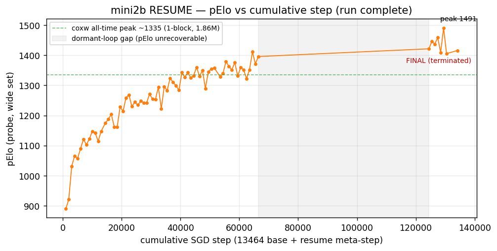

# mini2b — corpus-replay RESUME run (COMPLETE)

_Auto-generated from `loop_state.txt`. Run terminated at cumulative step **134159** (ᶠ) · final pElo **1416** · run peak **1491**._

Full interactive sweep (all runs, all metrics, stable-rank utilization): **[`dcm_master.html`](../dcm_master.html)** — reload to refresh.

## Architecture

**mini2b** — 2,252,689 params · bf16 compute / F32 stored · input `basic30` (30×8×8)

| stage | spec |
|---|---|
| stem | 7×7 conv → 128ch |
| block 0 | ReZero, 128ch, **7×7 + 7×7**, pre-act ReLU, LayerNorm out-norm, clean-add skip, α₀=0.5 (soft 0.5·tanh, cap 0.5), no SE |
| block 1 | ReZero, 128ch, **3×3 + 3×3**, pre-act ReLU, LayerNorm out-norm, clean-add skip, α₀=0.5 (cap 0.5), no SE |
| policy head | `intermediate_conv`, pre_conv 128ch → 4864 logits |
| value head | `wdl_softmax` (3-logit W/D/L), conv 16ch → 128 hidden → 3 |

A small 2-block / 128-wide net with a 7×7→3×3 kernel staircase and no squeeze-excite. Warm-started (weights-only via `--start-model`; BN running stats reset on resume) from its own 13464-step checkpoint, then trained continuously on the same corpus until terminated by graceful SIGINT.

## Data table

Per-1000-step marks. `step` = cumulative (13464 base + resume meta-step). Bold row = final (ᶠ). 

- **Marks ≤ 66464** and **≥ 124464**: full data (frozen checkpoint probed + internals parsed).
- **Marks 67464–123464** (`—` in pElo/nll/bn1Mean/Σαeff²/pLogit): the monitoring loop was dormant ~58k steps; the out-model autosave overwrote those weights before they could be frozen, so probe/internals are **unrecoverable**. pLoss/vLoss/legalMass/gNorm are preserved from the `[REPLAY]` save lines (shaded region in the graph).

| step | pElo | nll | pLoss | vLoss | legalMass | bn1Mean | gNorm | Σαeff² | pLogit μ/peak |
|---|---|---|---|---|---|---|---|---|---|
| 1000 | 889.9 | 3.169 | 3.09 | 0.82 | 0.9185 | 2.766 | 1.531 | 0.3042 | 14.62/19.375 |
| 2000 | 920.5 | 3.061 | 3.00 | 0.84 | 0.9438 | 3.422 | 1.367 | 0.2884 | 15.39/21.125 |
| 3000 | 1031.0 | 2.839 | 2.94 | 0.81 | 0.9561 | 3.797 | 1.266 | 0.2825 | 15.85/21.625 |
| 4000 | 1065.4 | 2.747 | 2.91 | 0.80 | 0.9622 | 4.031 | 1.289 | 0.2808 | 16.26/22.375 |
| 5000 | 1057.0 | 2.777 | 2.88 | 0.81 | 0.9661 | 4.219 | 1.203 | 0.2790 | 16.19/22.75 |
| 6000 | 1089.7 | 2.698 | 2.91 | 0.82 | 0.9695 | 4.312 | 1.188 | 0.2800 | 16.47/23.25 |
| 7000 | 1120.6 | 2.675 | 2.89 | 0.84 | 0.9713 | 4.469 | 1.203 | 0.2800 | 16.45/22.75 |
| 8000 | 1102.8 | 2.677 | 2.88 | 0.82 | 0.9773 | 4.562 | 1.180 | 0.2813 | 16.44/22.75 |
| 9000 | 1121.7 | 2.681 | 2.88 | 0.82 | 0.9758 | 4.656 | 1.148 | 0.2806 | 16.52/23.375 |
| 10000 | 1147.3 | 2.640 | 2.88 | 0.82 | 0.9766 | 4.719 | 1.219 | 0.2827 | 16.64/23.125 |
| 11000 | 1141.5 | 2.643 | 2.86 | 0.82 | 0.9811 | 4.781 | 1.117 | 0.2833 | 16.66/23.5 |
| 12000 | 1114.3 | 2.679 | 2.83 | 0.81 | 0.9812 | 4.812 | 1.016 | 0.2838 | 16.71/24.0 |
| 13000 | 1147.3 | 2.631 | 2.84 | 0.80 | 0.9822 | 4.812 | 1.031 | 0.2823 | 16.66/24.25 |
| 14464 | 1174.85 | 2.580 | 2.89 | 0.82 | 0.9838 | 0.158 | 0.977 | 0.2843 | 16.60/23.125 |
| 15464 | 1187.32 | 2.578 | 2.83 | 0.83 | 0.9829 | 0.165 | 1.102 | 0.2858 | 16.67/23.375 |
| 16464 | 1203.41 | 2.558 | 2.86 | 0.80 | 0.9840 | 0.170 | 1.125 | 0.2862 | 16.67/23.625 |
| 17464 | 1162.37 | 2.590 | 2.84 | 0.80 | 0.9836 | 0.172 | 1.094 | 0.2890 | 16.65/23.5 |
| 18464 | 1162.37 | 2.632 | 2.86 | 0.81 | 0.9852 | 0.176 | 0.988 | 0.2874 | 16.60/23.75 |
| 19464 | 1228.28 | 2.513 | 2.80 | 0.82 | 0.9858 | 0.180 | 1.055 | 0.2909 | 16.72/23.625 |
| 20464 | 1213.78 | 2.536 | 2.86 | 0.84 | 0.9849 | 0.186 | 1.047 | 0.2907 | 16.69/24.0 |
| 21464 | 1258.80 | 2.492 | 2.83 | 0.82 | 0.9856 | 0.190 | 0.977 | 0.2921 | 16.61/23.75 |
| 22464 | 1268.61 | 2.452 | 2.81 | 0.80 | 0.9869 | 0.194 | 1.016 | 0.2932 | 16.54/23.625 |
| 23464 | 1229.84 | 2.511 | 2.80 | 0.82 | 0.9877 | 0.197 | 0.812 | 0.2933 | 16.51/23.875 |
| 24464 | 1244.84 | 2.528 | 2.80 | 0.82 | 0.9886 | 0.200 | 0.926 | 0.2952 | 16.57/24.125 |
| 25464 | 1234.49 | 2.512 | 2.80 | 0.81 | 0.9889 | 0.203 | 0.918 | 0.2959 | 16.49/23.75 |
| 26464 | 1247.94 | 2.473 | 2.81 | 0.82 | 0.9882 | 0.207 | 0.844 | 0.3012 | 16.54/24.0 |
| 27464 | 1242.25 | 2.498 | 2.83 | 0.82 | 0.9884 | 0.211 | 0.926 | 0.2995 | 16.45/24.625 |
| 28464 | 1241.22 | 2.496 | 2.80 | 0.82 | 0.9901 | 0.214 | 0.957 | 0.3006 | 16.58/24.75 |
| 29464 | 1271.19 | 2.447 | 2.77 | 0.82 | 0.9901 | 0.218 | 1.273 | 0.3035 | 16.46/24.125 |
| 30464 | 1255.18 | 2.469 | 2.61 | 0.84 | 0.9900 | 0.221 | 3.203 | 0.3050 | 16.48/24.25 |
| 31464 | 1252.60 | 2.497 | 2.83 | 0.82 | 0.9897 | 0.224 | 1.602 | 0.3065 | 16.42/24.125 |
| 32464 | 1294.41 | 2.437 | 2.72 | 0.84 | 0.9900 | 0.227 | 1.383 | 0.3080 | 16.45/24.375 |
| 33464 | 1222.07 | 2.519 | 2.78 | 0.79 | 0.9902 | 0.231 | 0.879 | 0.3095 | 16.41/24.5 |
| 34464 | 1295.96 | 2.445 | 2.77 | 0.80 | 0.9907 | 0.234 | 1.031 | 0.3088 | 16.45/24.875 |
| 35464 | 1283.06 | 2.436 | 2.81 | 0.81 | 0.9904 | 0.237 | 0.859 | 0.3110 | 16.39/24.375 |
| 36464 | 1324.30 | 2.404 | 2.83 | 0.81 | 0.9904 | 0.240 | 1.148 | 0.3118 | 16.42/24.75 |
| 37464 | 1310.39 | 2.410 | 2.80 | 0.81 | 0.9910 | 0.243 | 0.816 | 0.3141 | 16.31/24.875 |
| 38464 | 1299.05 | 2.418 | 2.81 | 0.80 | 0.9916 | 0.246 | 0.816 | 0.3178 | 16.35/24.375 |
| 39464 | 1284.10 | 2.451 | 2.81 | 0.82 | 0.9918 | 0.249 | 0.992 | 0.3178 | 16.30/24.625 |
| 40464 | 1342.84 | 2.365 | 2.80 | 0.83 | 0.9927 | 0.252 | 0.965 | 0.3201 | 16.37/24.25 |
| 41464 | 1327.39 | 2.380 | 2.70 | 0.82 | 0.9921 | 0.254 | 1.828 | 0.3187 | 16.16/23.625 |
| 42464 | 1342.84 | 2.386 | 2.78 | 0.79 | 0.9915 | 0.260 | 0.934 | 0.3246 | 16.24/24.5 |
| 43464 | 1324.82 | 2.403 | 2.69 | 0.82 | 0.9916 | 0.260 | 1.711 | 0.3232 | 16.18/24.875 |
| 44464 | 1332.54 | 2.414 | 2.78 | 0.84 | 0.9934 | 0.264 | 1.008 | 0.3247 | 16.10/24.75 |
| 45464 | 1360.33 | 2.383 | 2.75 | 0.80 | 0.9928 | 0.264 | 0.918 | 0.3262 | 16.11/24.375 |
| 46464 | 1329.97 | 2.404 | 2.78 | 0.80 | 0.9927 | 0.266 | 0.934 | 0.3300 | 16.08/23.75 |
| 47464 | 1349.53 | 2.364 | 2.78 | 0.82 | 0.9933 | 0.270 | 1.211 | 0.3270 | 16.08/24.0 |
| 48464 | 1289.77 | 2.434 | 2.83 | 0.82 | 0.9927 | 0.273 | 1.633 | 0.3286 | 15.97/24.75 |
| 49464 | 1345.41 | 2.389 | 2.80 | 0.81 | 0.9932 | 0.273 | 2.531 | 0.3339 | 16.08/24.25 |
| 50464 | 1355.19 | 2.358 | 2.75 | 0.82 | 0.9925 | 0.277 | 1.070 | 0.3324 | 16.00/23.875 |
| 51464 | 1358.28 | 2.355 | 2.66 | 0.82 | 0.9930 | 0.281 | 2.000 | 0.3362 | 16.08/24.375 |
| 53464 | 1328.94 | 2.416 | 2.73 | 0.81 | 0.9939 | 0.285 | 0.973 | 0.3415 | 15.86/24.375 |
| 54464 | 1339.75 | 2.404 | 2.81 | 0.81 | 0.9945 | 0.287 | 0.910 | 0.3400 | 15.87/24.75 |
| 55464 | 1379.87 | 2.325 | 2.75 | 0.82 | 0.9940 | 0.289 | 0.875 | 0.3453 | 15.92/24.5 |
| 56464 | 1362.90 | 2.374 | 2.77 | 0.81 | 0.9937 | 0.291 | 0.910 | 0.3490 | 15.93/24.125 |
| 57464 | 1351.59 | 2.374 | 2.77 | 0.80 | 0.9939 | 0.293 | 0.859 | 0.3519 | 15.86/24.625 |
| 58464 | 1375.76 | 2.358 | 2.80 | 0.82 | 0.9944 | 0.295 | 1.398 | 0.3505 | 15.77/24.125 |
| 59464 | 1331.00 | 2.387 | 2.67 | 0.80 | 0.9940 | 0.297 | 1.586 | 0.3586 | 15.81/24.0 |
| 60464 | 1359.82 | 2.359 | 2.81 | 0.80 | 0.9948 | 0.299 | 0.996 | 0.3608 | 15.81/24.25 |
| 61464 | 1351.59 | 2.349 | 2.81 | 0.82 | 0.9946 | 0.303 | 2.047 | 0.3630 | 15.83/24.625 |
| 62464 | 1322.76 | 2.406 | 2.63 | 0.82 | 0.9947 | 0.305 | 3.250 | 0.3609 | 15.71/24.25 |
| 63464 | 1352.10 | 2.372 | 2.75 | 0.82 | 0.9935 | 0.305 | 0.742 | 0.3594 | 15.77/24.375 |
| 64464 | 1411.22 | 2.320 | 2.75 | 0.82 | 0.9945 | 0.309 | 0.734 | 0.3680 | 15.64/24.25 |
| 65464 | 1371.65 | 2.360 | 2.78 | 0.82 | 0.9936 | 0.313 | 0.797 | 0.3687 | 15.64/24.0 |
| 66464 | 1395.81 | 2.331 | 2.72 | 0.82 | 0.9943 | 0.315 | 0.891 | 0.3750 | 15.73/24.25 |
| 67464 | — | — | 2.53 | 0.84 | 0.9942 | — | 2.984 | — | — |
| 68464 | — | — | 2.81 | 0.82 | 0.9945 | — | 2.672 | — | — |
| 69464 | — | — | 2.75 | 0.84 | 0.9946 | — | 2.297 | — | — |
| 70464 | — | — | 2.80 | 0.85 | 0.9948 | — | 2.547 | — | — |
| 71464 | — | — | 2.73 | 0.82 | 0.9955 | — | 0.809 | — | — |
| 72464 | — | — | 2.73 | 0.82 | 0.9954 | — | 0.789 | — | — |
| 73464 | — | — | 2.73 | 0.82 | 0.9953 | — | 0.832 | — | — |
| 74464 | — | — | 2.72 | 0.81 | 0.9949 | — | 1.039 | — | — |
| 75464 | — | — | 2.78 | 0.82 | 0.9953 | — | 0.938 | — | — |
| 76464 | — | — | 2.59 | 0.85 | 0.9952 | — | 3.391 | — | — |
| 77464 | — | — | 2.69 | 0.83 | 0.9949 | — | 1.484 | — | — |
| 78464 | — | — | 2.73 | 0.80 | 0.9953 | — | 0.809 | — | — |
| 79464 | — | — | 2.67 | 1.04 | 0.9960 | — | 7.906 | — | — |
| 80464 | — | — | 2.78 | 0.82 | 0.9947 | — | 1.367 | — | — |
| 81464 | — | — | 2.75 | 0.84 | 0.9946 | — | 0.980 | — | — |
| 82464 | — | — | 2.80 | 0.80 | 0.9955 | — | 0.715 | — | — |
| 83464 | — | — | 2.53 | 0.86 | 0.9955 | — | 4.594 | — | — |
| 84464 | — | — | 2.80 | 0.81 | 0.9953 | — | 0.777 | — | — |
| 85464 | — | — | 2.69 | 0.81 | 0.9953 | — | 1.008 | — | — |
| 86464 | — | — | 2.53 | 0.85 | 0.9953 | — | 3.203 | — | — |
| 87464 | — | — | 2.72 | 0.81 | 0.9957 | — | 0.820 | — | — |
| 88464 | — | — | 2.78 | 0.81 | 0.9956 | — | 0.902 | — | — |
| 89464 | — | — | 2.72 | 0.81 | 0.9951 | — | 0.746 | — | — |
| 90464 | — | — | 2.75 | 0.83 | 0.9961 | — | 1.000 | — | — |
| 91464 | — | — | 2.73 | 0.81 | 0.9953 | — | 0.742 | — | — |
| 92464 | — | — | 2.61 | 0.84 | 0.9957 | — | 2.156 | — | — |
| 93464 | — | — | 2.72 | 0.81 | 0.9948 | — | 0.789 | — | — |
| 94464 | — | — | 2.75 | 0.80 | 0.9961 | — | 0.688 | — | — |
| 95464 | — | — | 2.69 | 0.83 | 0.9958 | — | 0.926 | — | — |
| 96464 | — | — | 2.77 | 0.83 | 0.9962 | — | 0.887 | — | — |
| 97464 | — | — | 2.75 | 0.84 | 0.9947 | — | 0.887 | — | — |
| 98464 | — | — | 2.77 | 0.81 | 0.9949 | — | 0.699 | — | — |
| 99464 | — | — | 2.70 | 0.82 | 0.9959 | — | 0.840 | — | — |
| 100464 | — | — | 2.73 | 0.82 | 0.9961 | — | 0.672 | — | — |
| 101464 | — | — | 2.78 | 0.80 | 0.9958 | — | 0.754 | — | — |
| 102464 | — | — | 2.73 | 0.79 | 0.9957 | — | 0.750 | — | — |
| 103464 | — | — | 2.75 | 0.79 | 0.9960 | — | 0.738 | — | — |
| 104464 | — | — | 2.72 | 0.80 | 0.9962 | — | 0.797 | — | — |
| 105464 | — | — | 2.75 | 0.82 | 0.9965 | — | 0.824 | — | — |
| 106464 | — | — | 2.47 | 0.92 | 0.9948 | — | 7.094 | — | — |
| 107464 | — | — | 2.81 | 0.80 | 0.9965 | — | 0.754 | — | — |
| 108464 | — | — | 2.80 | 0.82 | 0.9966 | — | 1.031 | — | — |
| 109464 | — | — | 2.75 | 0.82 | 0.9958 | — | 0.895 | — | — |
| 110464 | — | — | 2.72 | 0.79 | 0.9965 | — | 0.715 | — | — |
| 111464 | — | — | 2.72 | 0.83 | 0.9959 | — | 0.875 | — | — |
| 112464 | — | — | 2.78 | 0.84 | 0.9958 | — | 1.508 | — | — |
| 113464 | — | — | 2.78 | 0.80 | 0.9962 | — | 0.805 | — | — |
| 114464 | — | — | 2.80 | 0.80 | 0.9960 | — | 0.734 | — | — |
| 115464 | — | — | 2.73 | 0.82 | 0.9955 | — | 0.805 | — | — |
| 116464 | — | — | 2.77 | 0.82 | 0.9964 | — | 0.699 | — | — |
| 117464 | — | — | 2.73 | 0.80 | 0.9965 | — | 0.730 | — | — |
| 118464 | — | — | 2.77 | 0.81 | 0.9962 | — | 0.828 | — | — |
| 119464 | — | — | 2.75 | 0.80 | 0.9962 | — | 0.727 | — | — |
| 120464 | — | — | 2.73 | 0.82 | 0.9959 | — | 0.691 | — | — |
| 121464 | — | — | 2.69 | 0.81 | 0.9959 | — | 1.008 | — | — |
| 122464 | — | — | 2.70 | 0.81 | 0.9958 | — | 0.762 | — | — |
| 123464 | — | — | 2.72 | 0.82 | 0.9961 | — | 0.719 | — | — |
| 124464 | 1421.49 | 2.261 | 2.69 | 0.82 | 0.9966 | 0.414 | 0.977 | 0.4680 | 14.69/23.125 |
| 125464 | 1446.14 | 2.266 | 2.77 | 0.81 | 0.9966 | 0.416 | 0.852 | 0.4697 | 14.71/23.625 |
| 126464 | 1436.90 | 2.276 | 2.83 | 0.84 | 0.9965 | 0.416 | 1.727 | 0.4726 | 14.80/23.375 |
| 127464 | 1458.97 | 2.246 | 2.72 | 0.80 | 0.9963 | 0.418 | 0.785 | 0.4722 | 14.62/23.25 |
| 128464 | 1409.17 | 2.285 | 2.70 | 0.83 | 0.9962 | 0.418 | 0.809 | 0.4741 | 14.62/22.375 |
| 129464 | 1491.31 | 2.226 | 2.75 | 0.80 | 0.9963 | 0.420 | 0.734 | 0.4748 | 14.61/22.625 |
| 130464 | 1405.57 | 2.271 | 2.80 | 0.81 | 0.9964 | 0.422 | 0.770 | 0.4762 | 14.75/22.75 |
| **134159 ᶠ** | **1415.84** | **2.280** | **2.73** | **0.82** | **0.9960** | **0.426** | **0.699** | **0.4797** | **14.57/23.125** |

## Read

- **No roll-over.** The question this resume tested — does the early-steep-LR mini2b roll over when pushed far — is answered: it didn't. From the last probed point before the gap (1396 @ 66464) through to termination (1416 @ 134159), pElo trended up, peaking 1491 @ 129464. The final probe lands at 1416, within the ~1405–1491 probe-scatter band of the last ~10 marks (pElo is quantized by discrete argmax-correct count, so single-mark swings of ±40 are sampling noise, not trend).
- **Capacity result.** mini2b (2-block, 2.25M) sits decisively above coxw's (1-block, 1.86M) all-time peak ~1335 — depth/capacity buys ceiling.
- **Internals at termination.** Both ReZero blocks saturated (α_eff ≈ 0.50 / 0.48, Σαeff² ≈ 0.48). bn1Mean re-accumulating since the resume BN reset (0.43 vs original ~4.8) — the cliff is a BN-stat re-init on the weights-only resume path (v5's session-style continuations carried BN stats forward and show no cliff), and the slow re-climb is the EMA re-seeded near zero, not a regime change. pLogit contained at run-lows (~14.6 mean / ~23 peak). legalMass ~0.996.
