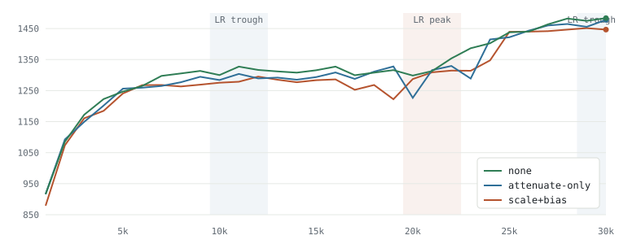
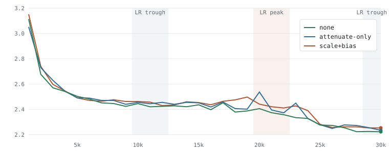

# SE style A/B/C — report at step 30,000

Corpus-replay comparison of squeeze-and-excitation variants on an otherwise identical 3-block 7×7 @128 v5 net. All three arms reached step 30,000 (the second LR-cycle trough) on 2026-09-30. Experiment record: [README.md](README.md).

## Result

- **No SE is best at both LR troughs** on both pElo and nll. At the 30k trough: none 1483.6 / 2.2227, attenuate-only 1478.0 / 2.2342, scale+bias 1446.7 / 2.2533.
- **nll is the steadier signal:** no SE had the lowest nll at 22 of the 24 marks from 7k to 30k (25 of all 30).
- **scale+bias is consistently last:** 49 behind no SE at the 11k trough and 37 behind at the 30k trough.
- **attenuate-only is close to no SE at the troughs but noisier:** mean absolute pElo change per mark from 10k to 30k is 29.0 (attenuate-only) vs 16.4 (none) and 18.8 (scale+bias). It dropped 101 at 20k near the LR peak.
- **At the LR peak (21k) the arms were level** (scale+bias 1308.8, attenuate-only 1316.1, none 1313.0), but around it the SE arms were unstable: scale+bias fell to 1222 at 19k and attenuate-only to 1227 at 20k, while no SE stayed at or above 1299 from 17k to 23k.
- **Provisional conclusion:** on this net, SE adds parameters without improving play or fit; scale+bias SE is measurably worse. One seed per arm, so gaps under ~44 pElo are within the measured seed spread (6.4–43.7).

## At the LR peak and troughs

The troughs (LR ≈ 9e-4) are the fair comparison points: the weights have settled, so one probe reflects the arm's real level. At the peak (LR ≈ 0.087) each checkpoint lands wherever the last large steps pushed it, so single-mark readings there are mostly noise; the peak is still reported because how an arm behaves under high LR is a result in itself.

| point | LR | scale+bias pElo / nll | attenuate-only pElo / nll | none pElo / nll |
|---|---|---|---|---|
| 11k trough | 0.000933 | 1278.4 / 2.4571 | 1303.7 / 2.4445 | 1327.4 / 2.4201 |
| 21k peak | 0.0871 | 1308.8 / 2.4205 | 1316.1 / 2.3952 | 1313.0 / 2.3733 |
| 30k trough | 0.000916 | 1446.7 / 2.2533 | 1478.0 / 2.2342 | 1483.6 / 2.2227 |

## Curves

Shaded bands: LR troughs (~11k, ~30k) and the cycle peak (~21k). Styled page: [report-30k.html](report-30k.html).

## Summary by arm (steps 1k–30k)

| | scale+bias | attenuate-only | none |
|---|---|---|---|
| params | 5,208,050 | 5,195,378 | 5,170,322 |
| ModelID | 20260929-12-JZOe | 20260929-13-06yp | 20260929-18-D9is |
| pElo @30k | 1446.7 | 1478.0 | 1483.6 |
| nll @30k | 2.2533 | 2.2342 | 2.2227 |
| peak pElo (step) | 1451.3 (29k) | 1478.0 (30k) | 1483.6 (30k) |
| mean pElo 20k–30k | 1385.2 | 1390.8 | 1412.4 |
| mean nll 20k–30k | 2.3325 | 2.3315 | 2.2975 |
| marks with best pElo | 2 of 30 | 8 of 30 | 20 of 30 |
| marks with best nll | 2 of 30 | 3 of 30 | 25 of 30 |
| mean |ΔpElo| per mark, 10k–30k | 18.8 | 29.0 | 16.4 |
| bn1Mean @30k | 0.2656 | 0.4727 | 0.2354 |
| legalMass @30k | 0.9957 | 0.9960 | 0.9965 |

## pElo and nll at every mark

| step | LR | momentum | scale+bias pElo | attenuate-only pElo | none pElo | scale+bias nll | attenuate-only nll | none nll |
|---|---|---|---|---|---|---|---|---|
| 1000 | 0.1 | 0.850 | 879.2 | 916.7 | 916.1 | 3.1516 | 3.0519 | 3.1137 |
| 2000 | 0.0887 | 0.853 | 1073.9 | 1092.8 | 1085.5 | 2.7400 | 2.7291 | 2.6770 |
| 3000 | 0.0635 | 0.860 | 1160.8 | 1149.3 | 1172.2 | 2.5973 | 2.6292 | 2.5701 |
| 4000 | 0.0379 | 0.871 | 1184.7 | 1201.9 | 1222.6 | 2.5454 | 2.5424 | 2.5411 |
| 5000 | 0.0198 | 0.885 | 1240.7 | 1256.2 | 1246.9 | 2.4899 | 2.4921 | 2.5029 |
| 6000 | 0.00966 | 0.900 | 1267.6 | 1259.3 | 1265.0 | 2.4710 | 2.4888 | 2.4813 |
| 7000 | 0.00471 | 0.916 | 1268.1 | 1265.0 | 1297.5 | 2.4642 | 2.4707 | 2.4513 |
| 8000 | 0.00246 | 0.929 | 1263.5 | 1276.9 | 1305.2 | 2.4757 | 2.4701 | 2.4458 |
| 9000 | 0.00147 | 0.941 | 1269.1 | 1294.4 | 1313.5 | 2.4621 | 2.4401 | 2.4233 |
| 10000 | 0.00105 | 0.948 | 1275.3 | 1284.1 | 1300.1 | 2.4619 | 2.4556 | 2.4457 |
| 11000 | 0.000933 | 0.950 | 1278.4 | 1303.7 | 1327.4 | 2.4571 | 2.4445 | 2.4201 |
| 12000 | 0.00104 | 0.948 | 1294.9 | 1289.2 | 1316.6 | 2.4294 | 2.4551 | 2.4237 |
| 13000 | 0.00143 | 0.941 | 1285.1 | 1291.8 | 1311.9 | 2.4348 | 2.4401 | 2.4280 |
| 14000 | 0.00236 | 0.929 | 1276.9 | 1285.1 | 1307.8 | 2.4595 | 2.4554 | 2.4207 |
| 15000 | 0.00446 | 0.916 | 1283.6 | 1293.4 | 1315.5 | 2.4535 | 2.4516 | 2.4359 |
| 16000 | 0.00902 | 0.900 | 1286.2 | 1308.3 | 1327.4 | 2.4363 | 2.4185 | 2.3972 |
| 17000 | 0.0182 | 0.885 | 1252.6 | 1287.7 | 1299.6 | 2.4638 | 2.4586 | 2.4524 |
| 18000 | 0.0344 | 0.871 | 1268.1 | 1310.9 | 1307.8 | 2.4748 | 2.4062 | 2.3787 |
| 19000 | 0.0569 | 0.860 | 1222.1 | 1327.9 | 1316.1 | 2.4972 | 2.4017 | 2.3876 |
| 20000 | 0.0784 | 0.853 | 1287.2 | 1226.7 | 1298.5 | 2.4410 | 2.5372 | 2.4057 |
| 21000 | 0.0871 | 0.851 | 1308.8 | 1316.1 | 1313.0 | 2.4205 | 2.3952 | 2.3733 |
| 22000 | 0.0773 | 0.854 | 1314.5 | 1329.5 | 1353.7 | 2.4109 | 2.3725 | 2.3575 |
| 23000 | 0.0553 | 0.861 | 1314.0 | 1288.7 | 1386.6 | 2.4274 | 2.4490 | 2.3341 |
| 24000 | 0.033 | 0.872 | 1347.5 | 1414.8 | 1402.5 | 2.3891 | 2.3260 | 2.3281 |
| 25000 | 0.0173 | 0.885 | 1439.5 | 1422.0 | 1437.9 | 2.2813 | 2.2782 | 2.2754 |
| 26000 | 0.00841 | 0.901 | 1440.0 | 1443.1 | 1440.0 | 2.2569 | 2.2489 | 2.2730 |
| 27000 | 0.0041 | 0.916 | 1441.5 | 1460.0 | 1463.6 | 2.2618 | 2.2769 | 2.2543 |
| 28000 | 0.00214 | 0.930 | 1446.7 | 1464.6 | 1482.1 | 2.2618 | 2.2726 | 2.2232 |
| 29000 | 0.00128 | 0.941 | 1451.3 | 1455.4 | 1474.9 | 2.2532 | 2.2553 | 2.2249 |
| 30000 | 0.000916 | 0.948 | 1446.7 | 1478.0 | 1483.6 | 2.2533 | 2.2342 | 2.2227 |

## Setup

- **Architecture:** v5-style, basic30 input, 7×7 stem → 3×[7×7+7×7 @128, SE /4, ReLU pre-act, ReZero α 0.447 (tanh-capped), clean_add, LayerNorm out], policy intermediate_conv (128), value WDL (16ch → FC128), bf16. Only `se_style` differs between arms.
- **Training:** corpus replay of `20260624-192615-w3aA5b` (Lichess 2026-05, 20.9M games), batch 4096, replay ratio 0.48, 500k buffer (250k prefill), weight decay 3e-4, warmup 1000, grad clip 15.
- **Schedule:** decaying LR cycle, peak 1e-1→1e-4 and trough 1e-3→1e-6 over 1M steps, 20k-step period starting at the peak; momentum follows the cycle (0.85→0.90 low, 0.95 high). Troughs fell at ~11k and ~30k.
- **Probes:** wide-set pElo / nll on each enumerated 1k-step checkpoint (`documentation/dashboards/data/se_{sb,att,none}.csv`).

## Caveats

- One random seed per arm; the audited seed spread for this family is 6.4–43.7 pElo.
- Arms ran concurrently on one GPU; compare by step, not by time.
- Runs are still going; these are results at step 30,000, not final.
