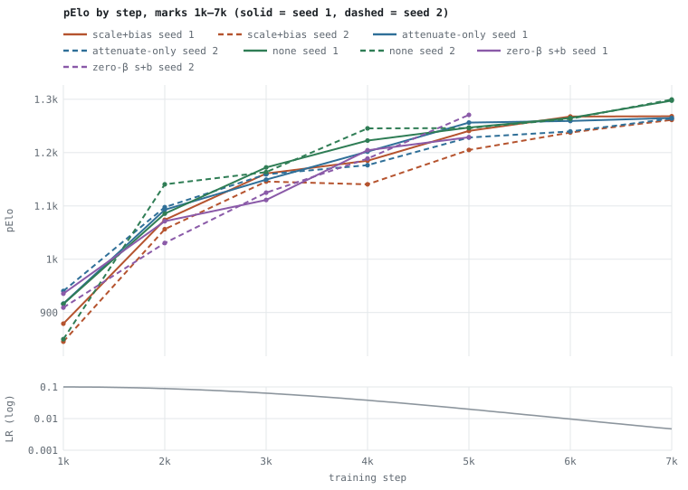
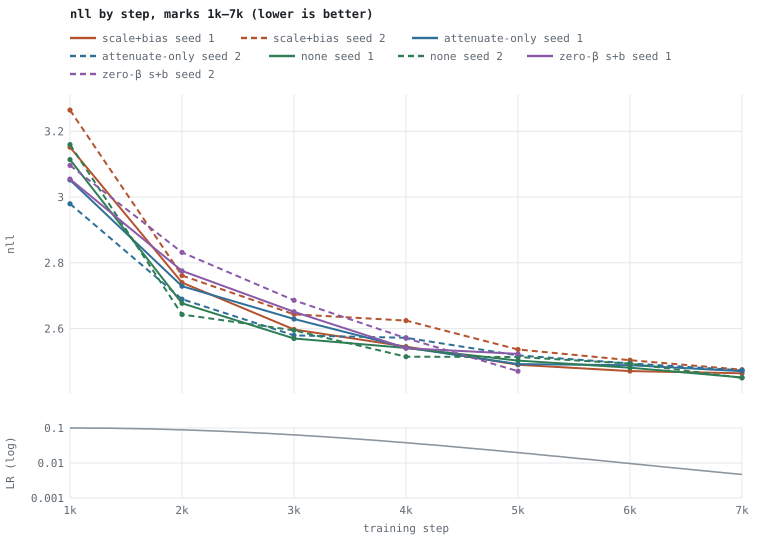
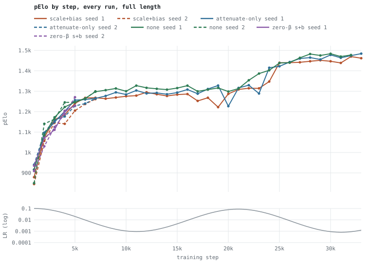
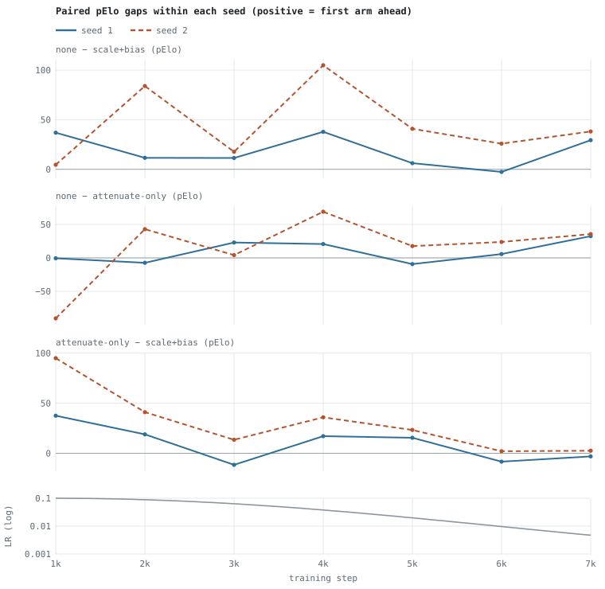
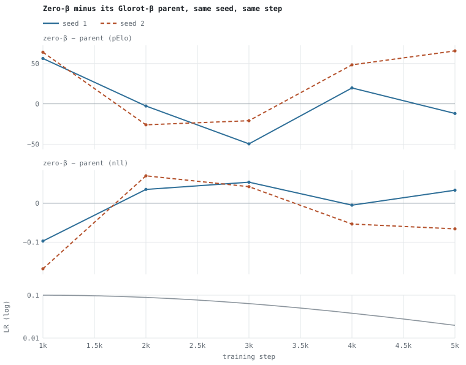
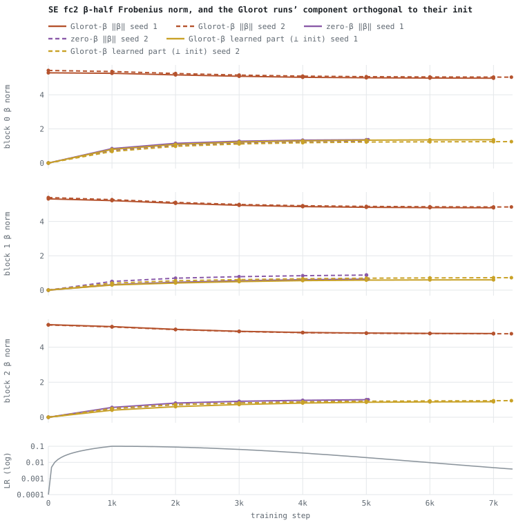
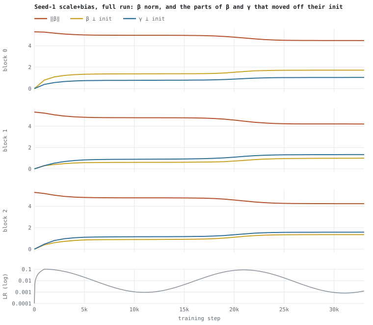
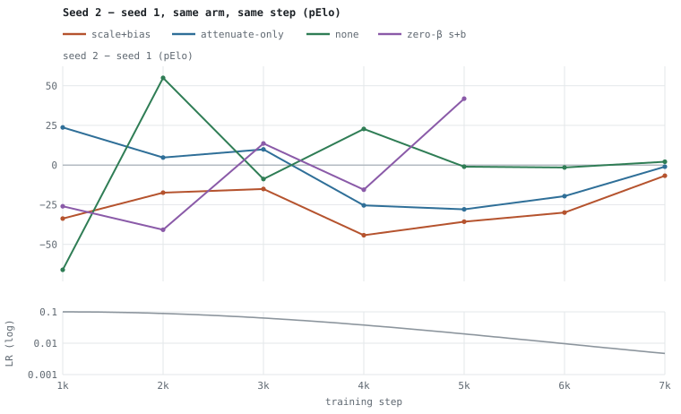

# SE style experiment — final report

Corpus-replay comparison of squeeze-and-excitation (SE) variants on an otherwise identical 3-block 7×7 @128 network: **scale+bias** SE, **attenuate-only** SE, **no SE**, plus a fourth arm, **zero-β scale+bias**, derived from the scale+bias fresh nets with only the β path zeroed. Two independent seeds per arm. Experiment record, launch details and the full reproduce recipe: [README.md](README.md). Earlier single-seed analysis at step 30,000: [REPORT-30k.md](REPORT-30k.md).

## Summary

- **Scale+bias SE is worse than both attenuate-only and no SE.** Both seeds agree on pElo and nll. Over marks 1k–7k the mean paired gap none − scale+bias is +18.7 (seed 1) and +45.2 (seed 2) pElo; attenuate-only − scale+bias is +9.5 and +30.5. Seed 1’s full run (1k–31k) gives none − scale+bias +30.8.
- **No SE is probably at least as good as attenuate-only, at worst similar.** none − attenuate-only is positive on average in both seeds (+9.2 and +14.7 over 1k–7k; +16.2 over seed 1’s full run), but the per-mark spread is large and the two seeds disagree on nll.
- **Zero-β did not rescue scale+bias in any consistent way.** Paired with its own Glorot-β parent (identical weights except β) over 1k–5k: +2.4 pElo (sd 39.2) in seed 1 and +26.3 (sd 45.9) in seed 2. At 5k it was the best seed-2 arm and the worst seed-1 arm. Against no SE it averaged −18.4 and −24.2.
- **β does learn, in both inits.** The part of the Glorot β that moved away from its random init reaches about the same size by 5k as the whole learned β in the zero-β runs (block 0: 1.34 vs 1.36 in seed 1). The random component (norm ≈ 5) is only shrunk slowly by weight decay. The earlier reading that β "barely trains" was wrong; see [β learning dynamics](#beta-learning-dynamics).
- **Run-to-run noise is about 20 pElo (sd) per run and is mostly training noise, not init noise.** Sharing the init (zero-β vs parent) did not make the paired comparison any quieter than comparing different inits: the seed-to-seed difference of the paired gap has RMS 40.7 pElo (1k–5k), vs 26.7–45.2 for the independently initialized arm gaps (1k–7k). The minibatch sampler is unseeded, so paired runs do not share batches.
- **Recommendation:** prefer no SE on this network (attenuate-only as a close second); drop scale+bias. A decisive answer on attenuate-only vs none, or on β init, needs about 4–8 seeds per arm, or the seeded-sampler work in plan #8 so paired runs actually share their training noise.

## Question and hypotheses

- Does the SE style matter on this net under corpus replay, holding everything else fixed? SE variants (per channel c, pooled features → FC1 → FC2):
  - scale+bias: `y_c = σ(γ_c)·x_c + β_c`, with γ and β both from FC2 (2C outputs).
  - attenuate-only: `y_c = σ(γ_c)·x_c` (FC2 has C outputs).
  - none: no SE block.
  - zero-β scale+bias: scale+bias whose β half of FC2 starts at exactly 0.
- H1 (seeds 1–2): the seed-1 ordering none ≥ attenuate-only > scale+bias replicates on fresh random inits.
- H2 (zero-β): scale+bias trails because its β path starts from random weights, adding an input-dependent random offset about the size of the signal. If so, zero-β should close the gap to attenuate-only / none.

## Design

- Network (all arms): v5, input basic30 (30 planes), stem 7×7→128, 3 blocks of 7×7+7×7 @128, ReLU pre-activation, ReZero α 0.447 (tanh cap 0.447), clean add, per-block output LayerNorm, policy intermediate_conv (4864), value WDL (16→FC128), bf16 compute. Only the SE style differs (and β init for zero-β).
- Training: corpus replay of `20260624-192615-w3aA5b` (lichess 2026-05 standard, first 20,935,171 games) in corpus order, 500k-position buffer, 250k prefill, batch 4096, weight decay 3e-4, LR cycle peak 1e-1 / trough 1e-3 over 20k steps with decay, warmup 1000 steps. Identical `parameters.json` and flags for every run.
- LR schedule (identical in all eight logs, checked point by point): warmup to 0.100 at 1k, down to 0.0198 at 5k and 0.00471 at 7k, trough 0.000933 at 11,000, peak 0.0871 at 20,900, trough 0.000813 at 30,950. Everything in the two-seed comparison (1k–7k) sits on the descent from the first peak.
- Seeds: seed 1 and seed 2 are two independent random inits of each preset (new fresh nets, new ModelIDs). The build has no seed option, so "seed" means an independent mint, not a numbered RNG seed.
- Zero-β derivation: `--derive-model --set-se-beta-init zero` on each seed’s scale+bias fresh net. The derived file is byte-identical to its parent except rows 128–255 (the β half) of each block’s SE fc2 weight [256, 32], which are set to 0. The β biases were already 0 at init. Verified byte-by-byte on all three blocks of both nets.
- Paired design: each zero-β run is compared with its parent run (same seed, same step). Sharing the init removes init noise, but not training noise: minibatch sampling is unseeded, so the two runs see different batches from step 1.
- Probe: every 1k-step checkpoint (and each stop save) is scored with `--probe-model <ckpt> --probe-set wide`, the 4,435-puzzle set. **pElo** is the puzzle-rating estimate (higher is better); **nll** is the mean negative log-likelihood of the solution moves (lower is better).

### Runs

| run | arm | seed | params | fresh ModelID | trained ModelID | build (git) | log | log start–end (CDT) | last 1k mark | stop save |
|---|---|---:|---:|---|---|---|---|---|---:|---:|
| `se_sb` | scale+bias | 1 | 5,208,050 | `20260929-12-JZOe` | `20260929-22-bWdy` | 2255 (`5826e1c`) | `dcm_log_20260929-150727` | 15:07:27–10:37:19 | 33,000 | 33,014 |
| `se_att` | attenuate-only | 1 | 5,195,378 | `20260929-13-06yp` | `20260929-23-L6Qm` | 2255 (`5826e1c`) | `dcm_log_20260929-150735` | 15:07:35–10:36:20 | 33,000 | 33,012 |
| `se_none` | none | 1 | 5,170,322 | `20260929-18-D9is` | `20260929-24-834D` | 2255 (`5826e1c`) | `dcm_log_20260929-150743` | 15:07:43–10:39:59 | 32,000 | 32,036 |
| `se_sb2` | scale+bias | 2 | 5,208,050 | `20260930-1-H1Oq` | `20260930-4-k98x` | 2259 (`5f46da0`) | `dcm_log_20260930-104101` | 10:41:01–15:05:05 | 7,000 | 7,282 |
| `se_att2` | attenuate-only | 2 | 5,195,378 | `20260930-2-Gf9P` | `20260930-5-5TXu` | 2259 (`5f46da0`) | `dcm_log_20260930-104109` | 10:41:09–15:05:04 | 7,000 | 7,289 |
| `se_none2` | none | 2 | 5,170,322 | `20260930-3-V9zk` | `20260930-6-LkS6` | 2259 (`5f46da0`) | `dcm_log_20260930-104117` | 10:41:17–15:05:05 | 7,000 | 7,019 |
| `se_zb1` | zero-β s+b | 1 | 5,208,050 | `20260930-7-crxN` | `20260930-9-RrGx` | 2261 (`31253d5`) | `dcm_log_20260930-150544` | 15:05:44–17:15:47 | 5,000 | 5,030 |
| `se_zb2` | zero-β s+b | 2 | 5,208,050 | `20260930-8-8qyR` | `20260930-10-H51a` | 2261 (`31253d5`) | `dcm_log_20260930-150552` | 15:05:52–17:15:47 | 5,000 | 5,004 |

- Seed 1 ran 2026-09-29 15:07 → 2026-09-30 ~10:37 (three arms concurrently on one GPU). Seed 2 ran 2026-09-30 10:41 → 15:05 (three concurrently), stopped early by decision at the 7k marks. Zero-β ran 2026-09-30 15:05 → 17:15 (two concurrently), stopped at the 5k marks. Every stop was SIGINT right after an enumerated checkpoint, so each run also wrote a stop save.
- Builds: seed 1 = 2255 (`5826e1c` + the uncommitted trainer-config change later committed as `cbc1894`). Seed 2 = 2259 (`5f46da0`), which adds optimizer state to checkpoints (`d15f706`), so seed-2 files are about twice the size; training math for a fresh start is unchanged. Zero-β = 2261 (`31253d5` with uncommitted changes = the code of `8926221`, #7), which adds `se_beta_init`, format v4 and `--derive-model`; for Glorot β the graph is unchanged. Build numbers come from each checkpoint’s `built_by_build` metadata.
- Concurrency differs by phase (3, 3, then 2 processes on one GPU), so wall-clock throughput is not comparable. All comparisons here are by training step.

## Results: every run, every mark

Blank cells: the run never reached that step. Nothing is carried forward. LR is the scheduled learning rate at that step (from the logs).

### pElo at each 1k mark

| step | LR | scale+bias s1 | attenuate-only s1 | none s1 | zero-β s+b s1 | scale+bias s2 | attenuate-only s2 | none s2 | zero-β s+b s2 |
|---:|---:|---:|---:|---:|---:|---:|---:|---:|---:|
| 1,000 | 0.1 | 879.16 | 916.67 | 916.12 | 935.43 | 845.40 | 940.38 | 850.03 | 909.45 |
| 2,000 | 0.0887 | 1073.88 | 1092.83 | 1085.47 | 1071.25 | 1056.46 | 1097.56 | 1140.47 | 1030.46 |
| 3,000 | 0.0635 | 1160.80 | 1149.34 | 1172.25 | 1111.19 | 1145.69 | 1159.24 | 1163.41 | 1124.80 |
| 4,000 | 0.0379 | 1184.73 | 1201.86 | 1222.59 | 1204.45 | 1140.47 | 1176.41 | 1245.36 | 1188.88 |
| 5,000 | 0.0198 | 1240.70 | 1256.21 | 1246.91 | 1228.80 | 1204.97 | 1228.28 | 1245.87 | 1270.68 |
| 6,000 | 0.00966 | 1267.58 | 1259.31 | 1265.00 |  | 1237.60 | 1239.67 | 1263.45 |  |
| 7,000 | 0.00471 | 1268.09 | 1265.00 | 1297.51 |  | 1261.38 | 1263.96 | 1299.57 |  |
| 8,000 | 0.00246 | 1263.45 | 1276.87 | 1305.24 |  |  |  |  |  |
| 9,000 | 0.00147 | 1269.13 | 1294.41 | 1313.49 |  |  |  |  |  |
| 10,000 | 0.00105 | 1275.32 | 1284.10 | 1300.08 |  |  |  |  |  |
| 11,000 | 0.000933 | 1278.42 | 1303.69 | 1327.39 |  |  |  |  |  |
| 12,000 | 0.00104 | 1294.93 | 1289.25 | 1316.58 |  |  |  |  |  |
| 13,000 | 0.00143 | 1285.13 | 1291.83 | 1311.94 |  |  |  |  |  |
| 14,000 | 0.00236 | 1276.87 | 1285.13 | 1307.82 |  |  |  |  |  |
| 15,000 | 0.00446 | 1283.58 | 1293.38 | 1315.55 |  |  |  |  |  |
| 16,000 | 0.00902 | 1286.16 | 1308.33 | 1327.39 |  |  |  |  |  |
| 17,000 | 0.0182 | 1252.60 | 1287.71 | 1299.57 |  |  |  |  |  |
| 18,000 | 0.0344 | 1268.09 | 1310.91 | 1307.82 |  |  |  |  |  |
| 19,000 | 0.0569 | 1222.07 | 1327.91 | 1316.06 |  |  |  |  |  |
| 20,000 | 0.0784 | 1287.19 | 1226.73 | 1298.54 |  |  |  |  |  |
| 21,000 | 0.0871 | 1308.85 | 1316.06 | 1312.97 |  |  |  |  |  |
| 22,000 | 0.0773 | 1314.52 | 1329.45 | 1353.65 |  |  |  |  |  |
| 23,000 | 0.0553 | 1314.00 | 1288.74 | 1386.56 |  |  |  |  |  |
| 24,000 | 0.033 | 1347.47 | 1414.82 | 1402.49 |  |  |  |  |  |
| 25,000 | 0.0173 | 1439.47 | 1422.01 | 1437.93 |  |  |  |  |  |
| 26,000 | 0.00841 | 1439.98 | 1443.06 | 1439.98 |  |  |  |  |  |
| 27,000 | 0.0041 | 1441.52 | 1460.00 | 1463.59 |  |  |  |  |  |
| 28,000 | 0.00214 | 1446.65 | 1464.62 | 1482.07 |  |  |  |  |  |
| 29,000 | 0.00128 | 1451.27 | 1455.38 | 1474.89 |  |  |  |  |  |
| 30,000 | 0.000916 | 1446.65 | 1477.96 | 1483.61 |  |  |  |  |  |
| 31,000 | 0.000813 | 1438.44 | 1463.59 | 1469.75 |  |  |  |  |  |
| 32,000 | 0.000904 | 1469.75 | 1474.37 | 1477.45 |  |  |  |  |  |
| 33,000 | 0.00124 | 1461.54 | 1484.12 |  |  |  |  |  |  |

### nll at each 1k mark

| step | LR | scale+bias s1 | attenuate-only s1 | none s1 | zero-β s+b s1 | scale+bias s2 | attenuate-only s2 | none s2 | zero-β s+b s2 |
|---:|---:|---:|---:|---:|---:|---:|---:|---:|---:|
| 1,000 | 0.1 | 3.1516 | 3.0519 | 3.1137 | 3.0545 | 3.2644 | 2.9796 | 3.1595 | 3.0961 |
| 2,000 | 0.0887 | 2.7400 | 2.7291 | 2.6770 | 2.7754 | 2.7614 | 2.6894 | 2.6428 | 2.8317 |
| 3,000 | 0.0635 | 2.5973 | 2.6292 | 2.5701 | 2.6512 | 2.6435 | 2.5795 | 2.5950 | 2.6860 |
| 4,000 | 0.0379 | 2.5454 | 2.5424 | 2.5411 | 2.5404 | 2.6243 | 2.5720 | 2.5147 | 2.5709 |
| 5,000 | 0.0198 | 2.4899 | 2.4921 | 2.5029 | 2.5233 | 2.5365 | 2.5185 | 2.5136 | 2.4707 |
| 6,000 | 0.00966 | 2.4710 | 2.4888 | 2.4813 |  | 2.5041 | 2.4944 | 2.4937 |  |
| 7,000 | 0.00471 | 2.4642 | 2.4707 | 2.4513 |  | 2.4751 | 2.4732 | 2.4501 |  |
| 8,000 | 0.00246 | 2.4757 | 2.4701 | 2.4458 |  |  |  |  |  |
| 9,000 | 0.00147 | 2.4621 | 2.4401 | 2.4233 |  |  |  |  |  |
| 10,000 | 0.00105 | 2.4619 | 2.4556 | 2.4457 |  |  |  |  |  |
| 11,000 | 0.000933 | 2.4571 | 2.4445 | 2.4201 |  |  |  |  |  |
| 12,000 | 0.00104 | 2.4294 | 2.4551 | 2.4237 |  |  |  |  |  |
| 13,000 | 0.00143 | 2.4348 | 2.4401 | 2.4280 |  |  |  |  |  |
| 14,000 | 0.00236 | 2.4595 | 2.4554 | 2.4207 |  |  |  |  |  |
| 15,000 | 0.00446 | 2.4535 | 2.4516 | 2.4359 |  |  |  |  |  |
| 16,000 | 0.00902 | 2.4363 | 2.4185 | 2.3972 |  |  |  |  |  |
| 17,000 | 0.0182 | 2.4638 | 2.4586 | 2.4524 |  |  |  |  |  |
| 18,000 | 0.0344 | 2.4748 | 2.4062 | 2.3787 |  |  |  |  |  |
| 19,000 | 0.0569 | 2.4972 | 2.4017 | 2.3876 |  |  |  |  |  |
| 20,000 | 0.0784 | 2.4410 | 2.5372 | 2.4057 |  |  |  |  |  |
| 21,000 | 0.0871 | 2.4205 | 2.3952 | 2.3733 |  |  |  |  |  |
| 22,000 | 0.0773 | 2.4109 | 2.3725 | 2.3575 |  |  |  |  |  |
| 23,000 | 0.0553 | 2.4274 | 2.4490 | 2.3341 |  |  |  |  |  |
| 24,000 | 0.033 | 2.3891 | 2.3260 | 2.3281 |  |  |  |  |  |
| 25,000 | 0.0173 | 2.2813 | 2.2782 | 2.2754 |  |  |  |  |  |
| 26,000 | 0.00841 | 2.2569 | 2.2489 | 2.2730 |  |  |  |  |  |
| 27,000 | 0.0041 | 2.2618 | 2.2769 | 2.2543 |  |  |  |  |  |
| 28,000 | 0.00214 | 2.2618 | 2.2726 | 2.2232 |  |  |  |  |  |
| 29,000 | 0.00128 | 2.2532 | 2.2553 | 2.2249 |  |  |  |  |  |
| 30,000 | 0.000916 | 2.2533 | 2.2342 | 2.2227 |  |  |  |  |  |
| 31,000 | 0.000813 | 2.2702 | 2.2539 | 2.2394 |  |  |  |  |  |
| 32,000 | 0.000904 | 2.2569 | 2.2474 | 2.2373 |  |  |  |  |  |
| 33,000 | 0.00124 | 2.2611 | 2.2338 |  |  |  |  |  |  |

### Stop saves

| run | step | pElo | nll |
|---|---:|---:|---:|
| `se_sb` | 33,014 | 1452.81 | 2.2669 |
| `se_att` | 33,012 | 1481.04 | 2.2369 |
| `se_none` | 32,036 | 1482.07 | 2.2376 |
| `se_zb1` | 5,030 | 1240.19 | 2.5022 |
| `se_sb2` | 7,282 | 1262.93 | 2.4772 |
| `se_att2` | 7,289 | 1267.58 | 2.4684 |
| `se_none2` | 7,019 | 1284.61 | 2.4671 |
| `se_zb2` | 5,004 | 1250.53 | 2.4969 |



*pElo, marks 1k–7k, all eight runs. Solid = seed 1, dashed = seed 2. Bottom strip: learning rate (log scale).*



*nll (lower is better), marks 1k–7k.*



*Every run at full length. Only seed 1 continued past 7k. The LR strip shows the whole first cycle. Seed-1 detail: [REPORT-30k.md](REPORT-30k.md).*

## Paired comparisons within a seed

Each gap is row arm minus column arm at the same step in the same seed, then summarized over the marks in the window. Marks within one run are strongly correlated, so n counts marks, not independent samples; the independent sample size is the number of seeds (2).

| comparison | seed 1, 1k–7k: mean (sd) | seed 2, 1k–7k | pooled | range, both seeds | seed 1, 1k–31k | nll mean, s1 / s2 (1k–7k) |
|---|---:|---:|---:|---:|---:|---:|
| none − scale+bias | +18.7 (16.0) | +45.2 (36.3) | +31.9 (30.2) | −2.6 … +104.9 | +30.8 (21.2), n=31 | −0.0174 / −0.0628 |
| none − attenuate-only | +9.2 (16.3) | +14.7 (50.7) | +11.9 (36.3) | −90.4 … +69.0 | +16.2 (22.6), n=31 | −0.0095 / +0.0090 |
| attenuate-only − scale+bias | +9.5 (17.7) | +30.5 (32.2) | +20.0 (27.3) | −11.5 … +95.0 | +14.5 (28.4), n=31 | −0.0079 / −0.0718 |

### Per-mark gaps, 1k–7k (pElo)

| step | none − s+b s1 | none − s+b s2 | none − att s1 | none − att s2 | att − s+b s1 | att − s+b s2 |
|---:|---:|---:|---:|---:|---:|---:|
| 1,000 | +36.96 | +4.63 | −0.55 | −90.35 | +37.51 | +94.98 |
| 2,000 | +11.59 | +84.01 | −7.36 | +42.91 | +18.95 | +41.10 |
| 3,000 | +11.45 | +17.72 | +22.91 | +4.17 | −11.46 | +13.55 |
| 4,000 | +37.86 | +104.89 | +20.73 | +68.95 | +17.13 | +35.94 |
| 5,000 | +6.21 | +40.90 | −9.30 | +17.59 | +15.51 | +23.31 |
| 6,000 | −2.58 | +25.85 | +5.69 | +23.78 | −8.27 | +2.07 |
| 7,000 | +29.42 | +38.19 | +32.51 | +35.61 | −3.09 | +2.58 |

### Per-mark gaps, 1k–7k (nll; negative = first arm better)

| step | none − s+b s1 | none − s+b s2 | none − att s1 | none − att s2 | att − s+b s1 | att − s+b s2 |
|---:|---:|---:|---:|---:|---:|---:|
| 1,000 | −0.0379 | −0.1049 | +0.0618 | +0.1799 | −0.0997 | −0.2848 |
| 2,000 | −0.0630 | −0.1186 | −0.0521 | −0.0466 | −0.0109 | −0.0720 |
| 3,000 | −0.0272 | −0.0485 | −0.0591 | +0.0155 | +0.0319 | −0.0640 |
| 4,000 | −0.0043 | −0.1096 | −0.0013 | −0.0573 | −0.0030 | −0.0523 |
| 5,000 | +0.0130 | −0.0229 | +0.0108 | −0.0049 | +0.0022 | −0.0180 |
| 6,000 | +0.0103 | −0.0104 | −0.0075 | −0.0007 | +0.0178 | −0.0097 |
| 7,000 | −0.0129 | −0.0250 | −0.0194 | −0.0231 | +0.0065 | −0.0019 |



*Paired pElo gaps per seed. Seed 2’s gaps against scale+bias are larger, partly because seed 2’s scale+bias init sits consistently low (see seed noise).*

- none − scale+bias is positive at 13 of 14 seed×mark points; attenuate-only − scale+bias at 11 of 14; none − attenuate-only at 10 of 14.
- The attenuate-only − scale+bias gap moves almost in lockstep across seeds (correlation of the per-mark gaps between seeds 0.91); the gaps involving none do not (0.21 for none − s+b, 0.29 for none − att). The two SE arms appear to respond to the LR descent in the same way, the no-SE arm differently.
- Seed 1’s early window understates its full-run gaps: none − scale+bias +18.7 over 1k–7k vs +30.8 over 1k–31k; the gap grew around the second LR peak (see [REPORT-30k.md](REPORT-30k.md)). Seed 2 never reached that phase.

<a id="zero-beta"></a>

## Zero-β scale+bias vs its parent

| step | zero-β s1 | parent s1 | Δ s1 | att s1 | none s1 | zero-β s2 | parent s2 | Δ s2 | att s2 | none s2 |
|---:|---:|---:|---:|---:|---:|---:|---:|---:|---:|---:|
| 1,000 | 935.43 | 879.16 | +56.27 | 916.67 | 916.12 | 909.45 | 845.40 | +64.05 | 940.38 | 850.03 |
| 2,000 | 1071.25 | 1073.88 | −2.63 | 1092.83 | 1085.47 | 1030.46 | 1056.46 | −26.00 | 1097.56 | 1140.47 |
| 3,000 | 1111.19 | 1160.80 | −49.61 | 1149.34 | 1172.25 | 1124.80 | 1145.69 | −20.89 | 1159.24 | 1163.41 |
| 4,000 | 1204.45 | 1184.73 | +19.72 | 1201.86 | 1222.59 | 1188.88 | 1140.47 | +48.41 | 1176.41 | 1245.36 |
| 5,000 | 1228.80 | 1240.70 | −11.90 | 1256.21 | 1246.91 | 1270.68 | 1204.97 | +65.71 | 1228.28 | 1245.87 |

nll (Δ negative = zero-β better):

| step | zero-β s1 | parent s1 | Δ s1 | att s1 | none s1 | zero-β s2 | parent s2 | Δ s2 | att s2 | none s2 |
|---:|---:|---:|---:|---:|---:|---:|---:|---:|---:|---:|
| 1,000 | 3.0545 | 3.1516 | −0.0971 | 3.0519 | 3.1137 | 3.0961 | 3.2644 | −0.1683 | 2.9796 | 3.1595 |
| 2,000 | 2.7754 | 2.7400 | +0.0354 | 2.7291 | 2.6770 | 2.8317 | 2.7614 | +0.0703 | 2.6894 | 2.6428 |
| 3,000 | 2.6512 | 2.5973 | +0.0539 | 2.6292 | 2.5701 | 2.6860 | 2.6435 | +0.0425 | 2.5795 | 2.5950 |
| 4,000 | 2.5404 | 2.5454 | −0.0050 | 2.5424 | 2.5411 | 2.5709 | 2.6243 | −0.0534 | 2.5720 | 2.5147 |
| 5,000 | 2.5233 | 2.4899 | +0.0334 | 2.4921 | 2.5029 | 2.4707 | 2.5365 | −0.0658 | 2.5185 | 2.5136 |

| comparison (1k–5k) | seed 1 mean (sd) | seed 1 range | seed 2 mean (sd) | seed 2 range | nll mean s1 / s2 |
|---|---:|---:|---:|---:|---:|
| zero-β − parent (scale+bias) | +2.4 (39.2) | −49.6 … +56.3 | +26.3 (45.9) | −26.0 … +65.7 | +0.0041 / −0.0349 |
| zero-β − attenuate-only | −13.2 (23.3) | −38.2 … +18.8 | −15.5 (43.0) | −67.1 … +42.4 | +0.0200 / +0.0633 |
| zero-β − none | −18.4 (28.5) | −61.1 … +19.3 | −24.2 (67.1) | −110.0 … +59.4 | +0.0280 / +0.0460 |



*Zero-β minus its Glorot-β parent, per seed. pElo: positive = zero-β ahead; nll: negative = zero-β better. The two seeds move in the same direction for the first four marks and split at 5k.*

- The paired gap swings by up to 65.7 pElo between adjacent marks, and its mean over 1k–5k is +2.4 (seed 1) and +26.3 (seed 2), both well inside one sd. There is no consistent effect of β init on pElo.
- nll agrees: +0.0041 (seed 1) and −0.0349 (seed 2), opposite signs.
- At 5k the seeds disagree outright: seed 2’s zero-β is the best seed-2 arm (1270.68 vs none 1245.87); seed 1’s is the worst seed-1 arm (1228.80 vs scale+bias 1240.70).
- Against no SE, zero-β averages −18.4 and −24.2 over 1k–5k, and against attenuate-only −13.2 and −15.5: on average it did not reach either.
- H2 is not supported: removing the random β start did not produce the improvement it predicted, at the resolution this test has. It is not ruled out either; an effect of 10–20 pElo would be invisible here.

<a id="beta-learning-dynamics"></a>

## β learning dynamics

Computed from every enumerated checkpoint of the four scale+bias-style runs (plus the fresh nets at step 0), identified by `__metadata__` ModelID lineage. For each block, FC2’s weight is [256, 32]: rows 0–127 produce γ, rows 128–255 produce β. ‖·‖ is the Frobenius norm of that half. "⊥ init" is the norm of the part of the weights orthogonal to their step-0 values: pure weight decay only rescales a vector, so it leaves this at 0 and anything above 0 is gradient-driven change of direction. For zero-β the init is 0, so ⊥ init equals ‖β‖.

| run | step | ‖β‖ b0 | ‖β‖ b1 | ‖β‖ b2 | β⊥init b0 | β⊥init b1 | β⊥init b2 | γ⊥init b0 | γ⊥init b1 | γ⊥init b2 | mean\|β bias\| b0 | b1 | b2 |
|---|---:|---:|---:|---:|---:|---:|---:|---:|---:|---:|---:|---:|---:|
| `se_sb` | 0 | 5.290 | 5.315 | 5.283 | 0.000 | 0.000 | 0.000 | 0.000 | 0.000 | 0.000 | 0.0000 | 0.0000 | 0.0000 |
| `se_sb` | 1,000 | 5.260 | 5.217 | 5.174 | 0.795 | 0.296 | 0.400 | 0.393 | 0.309 | 0.466 | 0.0059 | 0.0032 | 0.0044 |
| `se_sb` | 2,000 | 5.166 | 5.059 | 5.016 | 1.092 | 0.411 | 0.601 | 0.564 | 0.537 | 0.804 | 0.0084 | 0.0050 | 0.0071 |
| `se_sb` | 3,000 | 5.085 | 4.941 | 4.907 | 1.229 | 0.493 | 0.726 | 0.659 | 0.689 | 0.971 | 0.0096 | 0.0058 | 0.0081 |
| `se_sb` | 4,000 | 5.027 | 4.867 | 4.840 | 1.301 | 0.553 | 0.806 | 0.711 | 0.780 | 1.059 | 0.0101 | 0.0061 | 0.0088 |
| `se_sb` | 5,000 | 4.997 | 4.827 | 4.806 | 1.338 | 0.581 | 0.856 | 0.744 | 0.838 | 1.108 | 0.0104 | 0.0063 | 0.0093 |
| `se_sb` | 6,000 | 4.980 | 4.806 | 4.788 | 1.354 | 0.594 | 0.874 | 0.756 | 0.868 | 1.126 | 0.0105 | 0.0064 | 0.0095 |
| `se_sb` | 7,000 | 4.972 | 4.796 | 4.780 | 1.363 | 0.600 | 0.884 | 0.761 | 0.882 | 1.136 | 0.0105 | 0.0064 | 0.0096 |
| `se_sb2` | 0 | 5.425 | 5.391 | 5.268 | 0.000 | 0.000 | 0.000 | 0.000 | 0.000 | 0.000 | 0.0000 | 0.0000 | 0.0000 |
| `se_sb2` | 1,000 | 5.365 | 5.273 | 5.153 | 0.673 | 0.404 | 0.498 | 0.498 | 0.377 | 0.617 | 0.0060 | 0.0029 | 0.0038 |
| `se_sb2` | 2,000 | 5.247 | 5.111 | 5.003 | 0.981 | 0.546 | 0.723 | 0.654 | 0.589 | 0.903 | 0.0090 | 0.0047 | 0.0060 |
| `se_sb2` | 3,000 | 5.153 | 4.992 | 4.894 | 1.115 | 0.610 | 0.813 | 0.758 | 0.726 | 1.071 | 0.0103 | 0.0056 | 0.0070 |
| `se_sb2` | 4,000 | 5.095 | 4.917 | 4.828 | 1.191 | 0.661 | 0.877 | 0.814 | 0.809 | 1.152 | 0.0109 | 0.0061 | 0.0075 |
| `se_sb2` | 5,000 | 5.062 | 4.877 | 4.794 | 1.229 | 0.693 | 0.914 | 0.846 | 0.866 | 1.192 | 0.0112 | 0.0063 | 0.0079 |
| `se_sb2` | 6,000 | 5.044 | 4.857 | 4.777 | 1.243 | 0.712 | 0.930 | 0.859 | 0.892 | 1.211 | 0.0113 | 0.0065 | 0.0080 |
| `se_sb2` | 7,000 | 5.036 | 4.847 | 4.769 | 1.252 | 0.723 | 0.942 | 0.865 | 0.907 | 1.225 | 0.0114 | 0.0065 | 0.0081 |
| `se_sb2` | 7,282 | 5.035 | 4.846 | 4.768 | 1.253 | 0.725 | 0.945 | 0.867 | 0.910 | 1.227 | 0.0114 | 0.0065 | 0.0081 |
| `se_zb1` | 0 | 0.000 | 0.000 | 0.000 | 0.000 | 0.000 | 0.000 | 0.000 | 0.000 | 0.000 | 0.0000 | 0.0000 | 0.0000 |
| `se_zb1` | 1,000 | 0.847 | 0.318 | 0.557 | 0.847 | 0.318 | 0.557 | 0.380 | 0.346 | 0.567 | 0.0083 | 0.0039 | 0.0046 |
| `se_zb1` | 2,000 | 1.152 | 0.456 | 0.808 | 1.152 | 0.456 | 0.808 | 0.544 | 0.593 | 0.899 | 0.0114 | 0.0058 | 0.0073 |
| `se_zb1` | 3,000 | 1.277 | 0.544 | 0.911 | 1.277 | 0.544 | 0.911 | 0.658 | 0.760 | 1.034 | 0.0129 | 0.0068 | 0.0084 |
| `se_zb1` | 4,000 | 1.338 | 0.607 | 0.966 | 1.338 | 0.607 | 0.966 | 0.710 | 0.922 | 1.095 | 0.0136 | 0.0072 | 0.0090 |
| `se_zb1` | 5,000 | 1.364 | 0.638 | 1.000 | 1.364 | 0.638 | 1.000 | 0.734 | 1.004 | 1.131 | 0.0139 | 0.0074 | 0.0094 |
| `se_zb1` | 5,030 | 1.365 | 0.638 | 1.000 | 1.365 | 0.638 | 1.000 | 0.734 | 1.006 | 1.133 | 0.0139 | 0.0074 | 0.0094 |
| `se_zb2` | 0 | 0.000 | 0.000 | 0.000 | 0.000 | 0.000 | 0.000 | 0.000 | 0.000 | 0.000 | 0.0000 | 0.0000 | 0.0000 |
| `se_zb2` | 1,000 | 0.745 | 0.504 | 0.484 | 0.745 | 0.504 | 0.484 | 0.400 | 0.380 | 0.489 | 0.0090 | 0.0041 | 0.0047 |
| `se_zb2` | 2,000 | 1.048 | 0.694 | 0.716 | 1.048 | 0.694 | 0.716 | 0.634 | 0.615 | 0.809 | 0.0127 | 0.0060 | 0.0073 |
| `se_zb2` | 3,000 | 1.166 | 0.783 | 0.816 | 1.166 | 0.783 | 0.816 | 0.745 | 0.740 | 0.978 | 0.0142 | 0.0070 | 0.0081 |
| `se_zb2` | 4,000 | 1.230 | 0.842 | 0.875 | 1.230 | 0.842 | 0.875 | 0.808 | 0.819 | 1.080 | 0.0150 | 0.0075 | 0.0086 |
| `se_zb2` | 5,000 | 1.266 | 0.874 | 0.910 | 1.266 | 0.874 | 0.910 | 0.841 | 0.861 | 1.136 | 0.0153 | 0.0078 | 0.0089 |
| `se_zb2` | 5,004 | 1.266 | 0.874 | 0.910 | 1.266 | 0.874 | 0.910 | 0.841 | 0.861 | 1.136 | 0.0153 | 0.0078 | 0.0089 |



*β-half norm per block, 0–7.3k. Glorot-β runs (rust) start near 5.3 and shrink slowly; zero-β runs (purple) grow from 0. Gold: the Glorot runs’ learned (orthogonal-to-init) part, which tracks the zero-β β closely.*

### Seed-1 scale+bias over the full run

| step | ‖β‖ b0 | b1 | b2 | cos(β, β₀) b0 | b1 | b2 | β⊥init b0 | b1 | b2 | γ⊥init b0 | b1 | b2 |
|---:|---:|---:|---:|---:|---:|---:|---:|---:|---:|---:|---:|---:|
| 0 | 5.290 | 5.315 | 5.283 | 1.0000 | 1.0000 | 1.0000 | 0.000 | 0.000 | 0.000 | 0.000 | 0.000 | 0.000 |
| 1,000 | 5.260 | 5.217 | 5.174 | 0.9885 | 0.9984 | 0.9970 | 0.795 | 0.296 | 0.400 | 0.393 | 0.309 | 0.466 |
| 5,000 | 4.997 | 4.827 | 4.806 | 0.9635 | 0.9927 | 0.9840 | 1.338 | 0.581 | 0.856 | 0.744 | 0.838 | 1.108 |
| 10,000 | 4.965 | 4.788 | 4.773 | 0.9609 | 0.9919 | 0.9821 | 1.375 | 0.609 | 0.898 | 0.773 | 0.900 | 1.151 |
| 15,000 | 4.956 | 4.777 | 4.764 | 0.9600 | 0.9916 | 0.9813 | 1.387 | 0.620 | 0.917 | 0.786 | 0.925 | 1.169 |
| 20,000 | 4.791 | 4.567 | 4.574 | 0.9482 | 0.9869 | 0.9703 | 1.523 | 0.736 | 1.107 | 0.886 | 1.094 | 1.341 |
| 25,000 | 4.501 | 4.223 | 4.256 | 0.9256 | 0.9737 | 0.9493 | 1.704 | 0.963 | 1.338 | 1.026 | 1.315 | 1.562 |
| 30,000 | 4.477 | 4.204 | 4.232 | 0.9238 | 0.9718 | 0.9475 | 1.714 | 0.991 | 1.354 | 1.037 | 1.331 | 1.576 |
| 33,014 | 4.474 | 4.202 | 4.229 | 0.9236 | 0.9714 | 0.9473 | 1.715 | 0.998 | 1.355 | 1.040 | 1.334 | 1.580 |



*Seed-1 scale+bias, all 35 checkpoints: ‖β‖ (rust), the learned part of β (gold) and of γ (blue). The random part of β is still most of its norm at 33k.*

- **Zero-β’s β grows steadily and is still growing at 5k** (block 0: 0.85, 1.15, 1.28, 1.34, 1.36 at 1k–5k in seed 1), with growth slowing as the LR falls.
- **The Glorot β learns about as much.** Its orthogonal-to-init part at 5k is 1.34/0.58/0.86 (blocks 0/1/2, seed 1) vs zero-β’s 1.36/0.64/1.00; seed 2: 1.23/0.69/0.91 vs 1.27/0.87/0.91.
- **γ moves by a similar amount** (γ⊥init at 5k, seed 1: 0.74/0.84/1.11). So β is not a dead path; it trains like the rest of the SE block.
- **The random component persists.** Seed 1’s Glorot β keeps cos(β, β₀) = 0.924/0.971/0.947 at 33,014 steps; its norm fell from 5.29/5.32/5.28 to 4.47/4.20/4.23.
- **The β bias mean stays at 0** (largest |mean| across all 174 block-checkpoints: 5.3e-05): the block-output LayerNorm cancels a common shift, so only the per-channel pattern of β bias can matter. Per-channel |β bias| grows to about 0.01.
- Correction to earlier notes: the seed-1 README said β "barely trains", based on its bias and its norm. The direction analysis shows that was wrong: β learned; the random init simply stays on top of what it learned.

## Seed noise

| arm | marks | mean (s2 − s1) | sd | min | max | mean \|gap\| | RMS gap |
|---|---:|---:|---:|---:|---:|---:|---:|
| scale+bias | 7 | −26.1 | 13.3 | −44.3 | −6.7 | 26.1 | 28.9 |
| attenuate-only | 7 | −5.1 | 19.6 | −27.9 | +23.7 | 16.1 | 18.9 |
| none | 7 | +0.3 | 36.5 | −66.1 | +55.0 | 22.5 | 33.8 |
| zero-β s+b | 5 | −5.4 | 33.1 | −40.8 | +41.9 | 27.6 | 30.1 |

### Per mark (seed 2 − seed 1, pElo)

| step | scale+bias | attenuate-only | none | zero-β s+b |
|---:|---:|---:|---:|---:|
| 1,000 | −33.76 | +23.71 | −66.09 | −25.98 |
| 2,000 | −17.42 | +4.73 | +55.00 | −40.79 |
| 3,000 | −15.11 | +9.90 | −8.84 | +13.61 |
| 4,000 | −44.26 | −25.45 | +22.77 | −15.57 |
| 5,000 | −35.73 | −27.93 | −1.04 | +41.88 |
| 6,000 | −29.98 | −19.64 | −1.55 |  |
| 7,000 | −6.71 | −1.04 | +2.06 |  |



*Seed 2 − seed 1 for the same arm and step. Seed 2’s scale+bias sits below its seed-1 twin at every mark.*

- Over the three original arms at 1k–7k (21 pairs): mean |gap| 21.6, median 19.6, RMS 27.9, max 66.1 pElo. One run’s seed noise is therefore about **19.7 pElo (sd)** (RMS ÷ √2), consistent with the 6.4–43.7 band from the earlier nt8y seed study.
- A difference between two single runs carries about ±28 pElo (1 sd) of noise, about the size of the effects measured. With n seeds per arm the difference of means has sd ≈ 28/√n: resolving it to ±10 takes about 8 seeds per arm, to ±15 (enough to call a 30-point effect at 2 sd) about 4.
- Seed 2’s scale+bias is −26.1 below its seed-1 twin on average, with the smallest sd of any arm (13.3): that one init draw was weaker, which inflates seed 2’s gaps against scale+bias. The true scale+bias deficit is probably between the two seeds’ numbers.
- Sharing the init did not reduce noise. The seed-to-seed difference of the paired zero-β − parent gap has RMS 40.7 over 1k–5k, about the same as for comparisons between independently initialized arms (42.9, 45.2, 26.7 for none − s+b, none − att, att − s+b, over 1k–7k). Most of the noise comes from training (unseeded sampling order, nondeterministic GPU reductions), not from the init.

## Conclusions

- **Scale+bias SE is worse than attenuate-only and no SE on this network.** Supported by both seeds on pElo and nll and by seed 1’s full run. This is the one conclusion both seeds back without qualification.
- **No SE ≥ attenuate-only, at worst similar.** Positive mean gaps in both seeds and over seed 1’s full run, but with large per-mark spread and seed disagreement on nll.
- **β init does not explain the scale+bias deficit** at the resolution of this test. Zero-β is not consistently better than its parent and on average stays below both attenuate-only and no SE.
- **β trains in both inits;** the Glorot init adds a slowly decaying random component on top of what it learns.
- **SE adds parameters without measurable benefit here.** The cheapest variant (none, 5,170,322 params) is the best or tied-best.

### Limits

- Two seeds. With two, the defensible claim is the direction both agree on; if two arms were truly equal, both seeds favouring the same named arm would still happen 25% of the time by chance.
- Marks within a run are strongly correlated; they are not independent evidence.
- Seed 2 and zero-β cover only the high-LR descent (1k–7k and 1k–5k). In seed 1 the SE arms swung ±60–130 pElo per mark around the LR peak ([REPORT-30k.md](REPORT-30k.md)), and the SE gap was largest there and smaller at the troughs.
- Engine builds differ between phases (2255, 2259, 2261); the changes are checkpoint contents and the β-init option, not training math, but it is a difference.
- One corpus, one architecture (3 blocks, 128 channels, LayerNorm block output), one training recipe.

### What we did not learn, and why

- Whether attenuate-only and no SE really differ: the mean gap (+9.2 to +16.2 pElo across the windows above) is below the ±28 noise of a two-run comparison.
- Whether β init matters at the 10–20 pElo level: the paired design did not cut the noise, because training noise dominates and the sampler is unseeded.
- Whether zero-β catches up at low LR: it was stopped at 5k, before the first trough.
- Whether SE helps on deeper or wider nets, or without the per-block LayerNorm (which already cancels any common β shift).

### Recommendations

- Use no SE for this network family; attenuate-only if an SE is wanted. Drop scale+bias.
- For future A/B tests: plan on 4+ seeds per arm for effects around 30 pElo, 8+ for 10-pElo effects, and compare at LR troughs where runs are steadiest.
- Make paired designs work by landing plan #8 (issue #8): a seeded sampler and exact resume, so a derived model and its parent see the same minibatches and differ only by the change under test. Today the paired gap still carries about 41 pElo (RMS) of seed-to-seed noise per mark.

## Reproduce

Build, corpus and fresh-net setup: [README.md › Reproduce](README.md#reproduce). With `BIN` and `M` set as there, and the fresh nets copied from `models/`:

```sh
# seeds 1 and 2: one process per arm, <arm> = scale+bias | attenuate-only | none
# (seed 2 files carry -seed2 in the name)
"$BIN" --replay-corpus 20260624-192615-w3aA5b \
  --start-model "$M/20260929-test_SE_<arm>[-seed2]-fresh.safetensors" \
  --out-model "$M/20260929-test_SE_<arm>[-seed2]-replay-latest.safetensors" \
  --parameters experiments/20260929-se-style-ab/parameters.json \
  --epochs 12 --enumerate-checkpoints

# zero-beta nets (or use the stored copies in models/)
for s in "" "-seed2"; do
  "$BIN" --derive-model \
    --from "experiments/20260929-se-style-ab/models/20260929-test_SE_scale+bias${s}-fresh.safetensors" \
    --set-se-beta-init zero \
    --out "$M/20260929-test_SE_zerobeta${s:-"-seed1"}-fresh.safetensors"
done

# zero-beta runs, <seed> = seed1 | seed2
"$BIN" --replay-corpus 20260624-192615-w3aA5b \
  --start-model "$M/20260929-test_SE_zerobeta-<seed>-fresh.safetensors" \
  --out-model "$M/20260929-test_SE_zerobeta-<seed>-replay-latest.safetensors" \
  --parameters experiments/20260929-se-style-ab/parameters.json \
  --epochs 12 --enumerate-checkpoints

# stop: SIGINT right after the last wanted enumerated checkpoint (writes a stop save)

# probe every checkpoint into documentation/dashboards/data/<run>.csv
cd documentation/dashboards
python3 -c "import replay; [replay.probe_backfill(r) for r in ('se_sb','se_att','se_none','se_sb2','se_att2','se_none2','se_zb1','se_zb2')]"

# regenerate every data file, chart and this report
cd ../..
python3 experiments/20260929-se-style-ab/make_final_report.py
```

- Not bit-exact: minibatch sampling is unseeded and GPU reductions are not guaranteed order-stable (README › Expected exactness). Expect curves that track, within the seed noise above.
- `make_final_report.py` reads the enumerated checkpoints from `~/Library/Application Support/DrewsChessMachine/Models/` for the β analysis; only the fresh nets and final checkpoints are in `models/`, so a clone without the original Models folder can regenerate everything except `se_fc2_norms.csv`.

## Data files

All in [data/](data/), described column by column in [data/README.md](data/README.md). Produced by [final_data.py](final_data.py).

| file | rows | what it holds |
|---|---:|---|
| [probes_all_runs.csv](data/probes_all_runs.csv) | 137 | Every probed checkpoint of all eight runs, long format: pElo, nll, losses, legal mass, gNorm, games fed. |
| [paired_gaps.csv](data/paired_gaps.csv) | 148 | Within-seed arm differences at each 1k mark (none−sb, none−att, att−sb, zb−sb, zb−att, zb−none), pElo and nll. |
| [seed_gaps.csv](data/seed_gaps.csv) | 26 | Seed 2 − seed 1 for the same arm and mark, pElo and nll. |
| [se_fc2_norms.csv](data/se_fc2_norms.csv) | 174 | Per checkpoint and block: γ/β norms of SE fc2, bias statistics, direction change vs init. |
| [lr_schedule.csv](data/lr_schedule.csv) | 661 | Learning rate and momentum at every logged step. |

Source series per run (the dashboard tracker’s CSVs): [se_sb.csv](../../documentation/dashboards/data/se_sb.csv), [se_att.csv](../../documentation/dashboards/data/se_att.csv), [se_none.csv](../../documentation/dashboards/data/se_none.csv), [se_sb2.csv](../../documentation/dashboards/data/se_sb2.csv), [se_att2.csv](../../documentation/dashboards/data/se_att2.csv), [se_none2.csv](../../documentation/dashboards/data/se_none2.csv), [se_zb1.csv](../../documentation/dashboards/data/se_zb1.csv), [se_zb2.csv](../../documentation/dashboards/data/se_zb2.csv).

## Charts

| file | shows |
|---|---|
| [final-pelo-1k-7k.svg](charts/final-pelo-1k-7k.svg) | pElo by step, 1k–7k, all runs, with LR strip |
| [final-nll-1k-7k.svg](charts/final-nll-1k-7k.svg) | nll by step, 1k–7k |
| [final-pelo-all.svg](charts/final-pelo-all.svg) | pElo by step, every run at full length |
| [final-arm-gaps.svg](charts/final-arm-gaps.svg) | Paired arm gaps per seed |
| [final-zerobeta-vs-parent.svg](charts/final-zerobeta-vs-parent.svg) | Zero-β minus parent, pElo and nll |
| [final-seed-gaps.svg](charts/final-seed-gaps.svg) | Seed 2 − seed 1 per arm |
| [final-beta-norms.svg](charts/final-beta-norms.svg) | β norms and learned β, 0–7.3k |
| [final-beta-seed1-long.svg](charts/final-beta-seed1-long.svg) | Seed-1 scale+bias β/γ over the full run |
| [chart-pelo-30k.svg](chart-pelo-30k.svg), [chart-nll-30k.svg](chart-nll-30k.svg) | Seed-1 curves to 30k with trough/peak bands (from the 30k report) |

## Artifacts

- Checkpoints (Git LFS) in [models/](models/), with ModelIDs, sizes and SHA-256s in [MODELS.md](MODELS.md): fresh nets for all eight runs; seed-1 step 30000, last marks and stop saves; seed-2 step 7000 and stop saves; zero-β step 5000 and stop saves.
- Gzipped run logs (Git LFS) in [logs/](logs/), one per run: `dcm_log_20260929-150727.txt.gz`, `dcm_log_20260929-150735.txt.gz`, `dcm_log_20260929-150743.txt.gz`, `dcm_log_20260930-150544.txt.gz`, `dcm_log_20260930-104101.txt.gz`, `dcm_log_20260930-104109.txt.gz`, `dcm_log_20260930-104117.txt.gz`, `dcm_log_20260930-150552.txt.gz`.
- Inputs: [parameters.json](parameters.json), [presets/](presets/).
- Generators: [final_data.py](final_data.py), [make_final_report.py](make_final_report.py); the 30k report’s [make_report.py](make_report.py).
