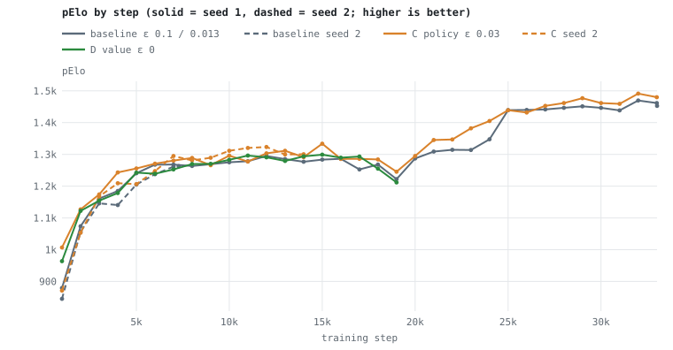
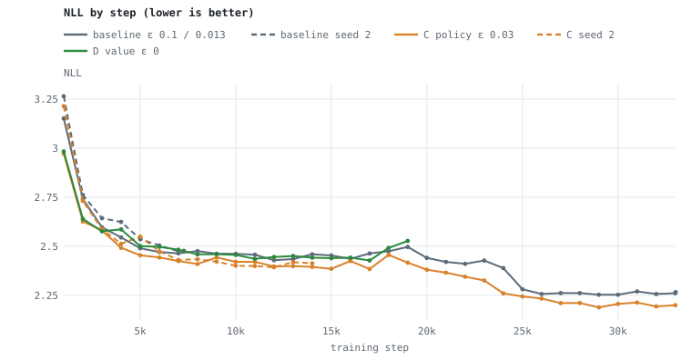
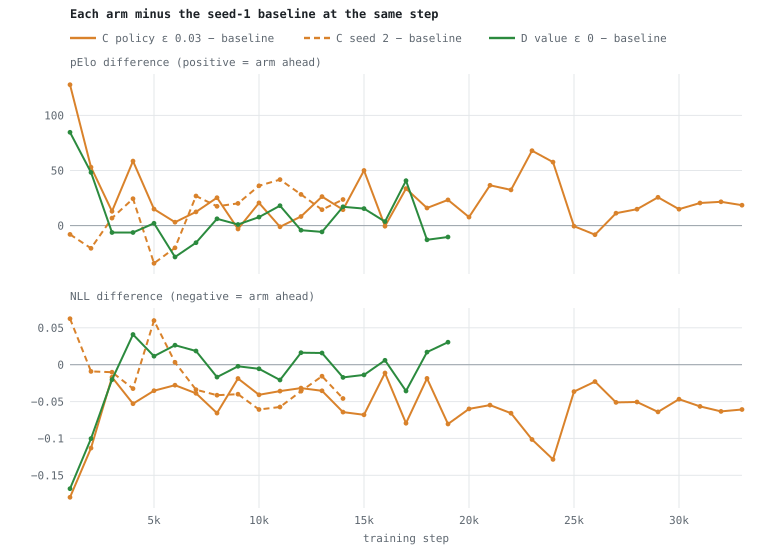

# 2026-10-02 — Label smoothing arm C: policy label smoothing ε 0.1 → 0.03 (`policy_label_smoothing_epsilon`)

**Status:** running since 2026-10-02 06:14, launched by the experiment chain when
leaky-FC1 ended (see `experiments/QUEUE.md`). Shares the GPU with the two no-ReZero
runs; arm D launches when no-ReZero seed 1 ends.

## Question

Is ε = 0.1 more policy smoothing than needed now that the shared offset can't drift (head-numerics Phase 2)? Proposal and background:
`documentation/plans-active/POLICY_LABEL_SMOOTHING_EXPERIMENTS.md`.

## Design

- **Only variable:** policy label smoothing ε 0.1 → 0.03 (`policy_label_smoothing_epsilon`). `parameters.json` here is the SE experiment's pinned
  file with that one key changed.
- **Starting net:** the SE experiment's scale+bias seed-1 fresh net
  (`20260929-test_SE_scale+bias-fresh.safetensors`, ModelID `20260929-12-JZOe`) —
  bit-identical to the baseline's start.
- **Baseline (not re-run):** ReLU scale+bias seed 1 (`se_sb`, 33,014 steps).
- **Everything else identical:** corpus `20260624-192615-w3aA5b`, 12 epochs, step
  limit 33,000, `--policy-tail-precision fp32_from_pre_bn` (the baseline's
  numerics), build 2275 (= `de0f22b`'s app code; stamped `f6fdd88`).
- **Measurements:** pElo / NLL every 1,000 steps (`--probe-set wide`); for C also
  NLL / top-1 by legal-move count bucket and policy entropy, `pLogitAbsMax`; for D
  value loss and W/D/L calibration.

## Charts

Every compared run, from the same columns as `table.py`; regenerate with
`python3 experiments/20261002-label-smoothing-C/charts.py` after new probes. Solid lines
are seed 1, dashed seed 2; arm D (value ε 0) is drawn here too.

## Launch record

| field | value |
|---|---|
| launched | 2026-10-02 06:14:25 CDT |
| build | Release build 2275 (frozen copy), stamped `f6fdd88` — the code of `de0f22b` |
| start model | `20260929-test_SE_scale+bias-fresh.safetensors`, ModelID `20260929-12-JZOe` |
| out model | `20261002-label-smoothing-C-replay-latest.safetensors` (+ enumerated `…-replay-step<N>`) |
| log | `~/Library/Logs/DrewsChessMachine/dcm_log_20261002-061425.txt` |
| probes | `probes.jsonl`, via `experiments/probe_loop.sh 20261002-label-smoothing-C probes.jsonl` |

`[REPLAY-HPARAMS]` matches the baseline's except `pLabelSmooth=0.03`.

## Review at 5,000 steps

Both checkpoints probed with the same binary (build 2275, `--probe-set wide`,
n = 4,435); training metrics are the `[REPLAY]` line at step 5,000 of each log.

| | baseline (ε 0.1) | C (ε 0.03) |
|---|---:|---:|
| pElo / NLL | 1239.2 / 2.4899 | 1255.7 / 2.4546 |
| top-1 / top-5 correct (of 4,435) | 1,451 / 3,162 | 1,483 / 3,189 |
| mean probability on the correct move / mean rank | 0.1384 / 5.50 | 0.1438 / 5.32 |
| policy logit abs max / peak | 17.17 / 27.81 | 17.31 / 26.28 |
| training: playedP / pEnt (nats) | 0.158 / 2.869 | 0.164 / 2.839 |
| training: loss / vLoss | 3.6534 / 0.8118 | 3.6142 / 0.8004 |

- pElo by 1k (C − baseline, dashboard values): +127.8, +53.0, +13.0, +58.6, +15.0.
  Ahead at 5 of 5, same initial weights and game feed order; NLL lower at 5 of 5.
- **Cross-build note (added 2026-10-02).** The by-1k pElo differences in this README
  subtract the baseline's *dashboard* values (`se_sb.csv`, probed by an earlier build
  with the fp32 policy-head tail) from C's `probes.jsonl` values (build 2275, mixed
  tail). On the same checkpoint the two builds differ by about 2.6 pElo (`se_sb` 10k:
  1275.3 in the CSV, 1277.9 on build 2275) and by at most 0.0002 NLL, so a by-1k pElo
  difference within about 3 of zero cannot be called either way. The same-binary
  reviews below (5k, 10k, 13k, 15k) and every NLL comparison are unaffected.
- Every probe measure moves the same way: top-1 +32, top-5 +27, probability on the
  correct move +0.0054, mean rank −0.17.
- Sharper policy, as expected from a sharper target: training entropy 0.03 nats lower
  and probability on the played move 0.006 higher. Logit magnitudes are unchanged
  (abs max 17.3 vs 17.2; the peak is lower), so less smoothing has not pushed logits
  outward so far.
- `pLoss` is not comparable across arms (the smoothed target's own entropy differs),
  so the training-loss gap is not evidence by itself.
- Not yet measured: NLL / top-1 by legal-move-count bucket (the probe does not
  report it).

## Review at 10,000 steps

Same method as the 5k review (same probe binary for both; one `[REPLAY]` line each).

| | baseline (ε 0.1) | C (ε 0.03) |
|---|---:|---:|
| pElo / NLL | 1277.9 / 2.4621 | 1296.0 / 2.4210 |
| top-1 / top-5 correct (of 4,435) | 1,526 / 3,223 | 1,561 / 3,226 |
| mean probability on the correct move / mean rank | 0.1410 / 5.31 | 0.1498 / 5.17 |
| policy logit abs max / peak | 18.08 / 29.66 | 18.17 / 29.06 |
| training: playedP / pEnt (nats) | 0.158 / 2.885 | 0.166 / 2.846 |
| training: loss / vLoss (single logged step) | 3.6107 / 0.7873 | 3.5625 / 0.8026 |

- Tally 1k–10k: pElo ahead at 9 of 10 (behind only at 9k, by 3.1), NLL lower at
  10 of 10. NLL gap by 1k from 4k: 0.053, 0.035, 0.028, 0.039, 0.066, 0.019, 0.041.
  The pElo tally is cross-build (see the 5k note): 6k (+3.1) and 9k (−3.1) are
  within the ≈2.6-pElo build offset, so C is ahead by more than it at 8 of 10.
- Top-1 +35 and probability on the correct move +0.0088 — both larger than at 5k;
  top-5 is now level (+3), so the gain is in ranking the right move first rather
  than in getting it into the top five.
- Logit magnitudes still match the baseline (abs max 18.2 vs 18.1, peak lower), so
  the overconfidence risk of less smoothing has not appeared by 10k.
- Same initial weights and game feed order, but one seed: minibatches are drawn from the
  replay buffer with an unseeded RNG, so the trajectories still diverge
  (the leaky-FC1 pair swung by up to 116 pElo at a single checkpoint), so a second
  C seed is what would make this conclusive.

## Position-by-position comparison at 13,000 steps

`--probe-positions-out` (added for this; one JSON line per position) on both 13k
checkpoints, same binary — Release build 2285, the code of `df25a56` before its
last edit (the check that `--probe-out` and `--probe-positions-out` differ, which
does not touch the output); `positions/compare.py` pairs the 4,435 wide-battery
positions by index. Files: `positions/base-13k.jsonl.gz`, `positions/C-13k.jsonl.gz`,
full report `positions/compare-13k.md`.

| | baseline (ε 0.1) | C (ε 0.03) | C − baseline | test |
|---|---:|---:|---:|---|
| mean NLL | 2.4348 | 2.3995 | −0.0353 | 95% bootstrap [−0.0454, −0.0252]; paired t = −6.87 |
| top-1 correct (of 4,435) | 1,539 | 1,591 | +52 | McNemar: 214 only baseline, 266 only C, exact p = 0.020 |
| positions with lower NLL | | | 2,516 of 4,435 | |
| mean legal-masked entropy (nats) | 2.859 | 2.813 | −0.046 | |
| top-1 probability > 0.9 | 0.16% | 0.20% | | |
| confident errors (top-1 wrong at p > 0.8) | 6 | 11 | | |
| expected calibration error | 0.1260 | 0.1255 | | |

- **Significance, and of what.** Over these positions the difference is clear for
  NLL and modest for top-1 (p = 0.02). This measures the probe-set sampling noise for
  *these two checkpoints* — not run-to-run noise. Whether a different training run
  of C would also beat a different baseline run is what C seed 2 tests (queued).
- **No sign of one-hot over-confidence.** Both nets are *under*-confident on these
  puzzles (in every bucket below p = 0.6 their top-1 is right more often than their
  stated probability), C's calibration error equals the baseline's, its entropy is
  only 0.05 nats lower, and the gain holds in every legal-move-count bucket. Confident
  errors rose from 6 to 11 — too few to read.
- **Limits.** These are Lichess puzzles: each has one correct move, so positions with
  several good moves cannot be picked out here, and over-confidence from memorizing
  positions cannot appear before the run starts a second pass over the corpus (33k
  steps is ~20% of the first).

## Review at 15,000 steps

Both checkpoints probed with Release build 2285 (`df25a56` code) with
`--probe-positions-out`; paired report `positions/compare-15k.md`, data
`positions/{base,C}-15k.jsonl.gz`. Training metrics: the `[REPLAY]` line at 15,000.

| | baseline (ε 0.1) | C (ε 0.03) |
|---|---:|---:|
| pElo / NLL | 1283.6 / 2.4534 | 1333.6 / 2.3855 |
| top-1 / top-5 correct (of 4,435) | 1,537 / 3,243 | 1,634 / 3,287 |
| mean probability on the correct move / mean rank | 0.1407 / 5.17 | 0.1533 / 4.94 |
| policy logit abs max / peak | 18.19 / 29.83 | 18.26 / 28.70 |
| mean legal-masked entropy (nats) | 2.873 | 2.817 |
| expected calibration error | 0.1293 | 0.1348 |
| confident errors (top-1 wrong at p > 0.8) | 6 | 7 |
| training: playedP / pEnt (nats) | 0.163 / 2.865 | 0.171 / 2.829 |
| training: loss / vLoss (single logged step) | 3.6184 / 0.8107 | 3.5559 / 0.8066 |

- **Paired over the 4,435 positions:** NLL −0.0679, 95% bootstrap [−0.0784, −0.0573],
  t = −12.53; top-1 +97, McNemar 210 only baseline vs 307 only C, exact p < 0.0001.
  The gap is larger than at 13k (−0.0353, +52). The improvement holds in every
  legal-move-count bucket (NLL −0.055 to −0.078).
- **Calibration:** both nets remain under-confident below p ≈ 0.6. C's ECE is a
  little higher (0.1348 vs 0.1293) because it is *more* under-confident in the lowest
  bucket (p < 0.1: accuracy 0.208 at mean p 0.082), not because it is over-confident;
  confident errors 6 vs 7, logits unchanged.
- **Tally 1k–15k:** NLL lower at 15 of 15, pElo ahead at 13 of 15. The pElo tally is
  cross-build (see the 5k note): 6k (+3.1), 9k (−3.1) and 11k (−1.0) are within the
  ≈2.6-pElo build offset, so C is ahead by more than it at 12 of 15; the NLL tally
  (smallest gap 0.0169) is unaffected.
- Same caveat as before: this is one training run of each; C seed 2 is queued.

## Seed 2 (queued)

Starts from the SE experiment's scale+bias **seed-2** fresh net
(`20260929-test_SE_scale+bias-seed2-fresh.safetensors`), so its first 7,282 steps pair
with the baseline's seed 2 (`se_sb2`) the way seed 1 pairs with `se_sb`. Out stem
`20261002-label-smoothing-C-seed2`, probes `probes-seed2.jsonl`. Launched by the
local queue script when a training slot frees, after zero-init ReZero and label
smoothing D (`experiments/QUEUE.md`).

