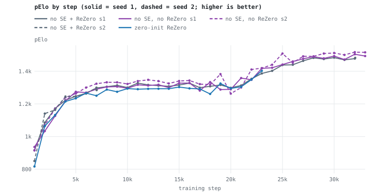
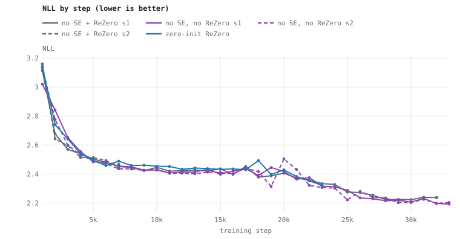
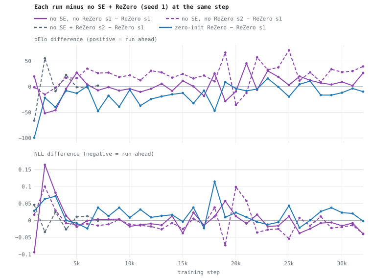

# 2026-10-02 — No SE, with vs without ReZero

**Status:** running (launched 2026-10-02 01:11 CDT), alongside the leaky-FC1 run.

## Question

Does ReZero help on the SE-experiment architecture without SE? The SE style
experiment found no-SE matching or beating every SE variant; ReZero has never been
tested on its own here.

## Design

- **Only variable:** `use_rezero` — on (existing runs) vs off (this run). With
  ReZero off, each block is `out = LayerNorm(x + F(x))` instead of
  `LayerNorm(x + α·F(x))` with α = 0.447·tanh(·).
- **Baselines (not re-run):** `se_none` seed 1 (32,036 steps) and seed 2
  (7,019), from `experiments/20260929-se-style-ab/`.
- **Init caveat:** removing ReZero removes tensors (the per-block α), so this run
  cannot start from a bit-identical copy of a baseline's fresh net. It is a fresh
  mint (`20261002-1-bh2u`, preset `bench_v5s3_noSE_noReZero`), so the comparison
  carries seed-to-seed noise (7–25 pElo on this setup). Two ReZero-on seeds bound
  that noise; add a second no-ReZero seed if the result is close.
- **Architecture:** basic30 → stem 128 (7×7) → 3×[7×7+7×7 @128, no SE, ReLU
  pre-act, clean_add, **no ReZero**, LayerNorm out] → policy intermediate_conv
  (128) · value WDL (16 → FC128) · bf16 · 5,170,319 params.
- **Corpus / parameters / numerics:** identical to the SE experiment (corpus
  `20260624-192615-w3aA5b`, its pinned `parameters.json`, 12 epochs, step limit
  33,000, `--policy-tail-precision fp32_from_pre_bn` to match the baselines' build).
- **Concurrency:** shares the GPU with the leaky-FC1 run; compare on step only.

## Charts

Every compared run, from the same columns as `table.py` (zero-init ReZero included);
regenerate with `python3 experiments/20261002-noSE-noReZero/charts.py` after new probes.
Solid lines are seed 1, dashed seed 2.







## Launch record

| field | value |
|---|---|
| launched | 2026-10-02 01:11:24 CDT |
| build | Release build 2275 (frozen copy, same as the leaky-FC1 run), stamped `f6fdd88` — the working tree committed as `de0f22b` |
| fresh net | `20261002-bench_v5s3_noSE_noReZero-fresh.safetensors`, ModelID `20261002-1-bh2u` |
| out model | `20261002-bench_v5s3_noSE_noReZero-replay-latest.safetensors` (+ enumerated `…-replay-step<N>`) |
| log | `~/Library/Logs/DrewsChessMachine/dcm_log_20261002-011124.txt` |

`[REPLAY-HPARAMS]` matches the SE experiment's runs. `probe_loop.sh` probes every
1,000-step checkpoint (`--probe-set wide`) into `probes.jsonl`; `table.py` renders
the comparison.

## Seed 2 (launched 2026-10-02 03:55)

At 6,000 steps seed 1 was level with both ReZero seeds (1269.1 vs 1265.0 / 1263.5),
inside the 7–25 pElo seed spread, so a second no-ReZero seed runs now rather than
after seed 1 ends. It shares the GPU with leaky-FC1 and seed 1 (three runs).

| field | value |
|---|---|
| launched | 2026-10-02 03:55:13 CDT |
| build | same frozen build 2275 (`f6fdd88` stamp, `de0f22b` code) |
| fresh net | `20261002-bench_v5s3_noSE_noReZero-seed2-fresh.safetensors`, ModelID `20261002-3-x4gI` (fresh mint, different init from seed 1) |
| out model | `20261002-bench_v5s3_noSE_noReZero-seed2-replay-latest.safetensors` (+ enumerated `…-replay-step<N>`) |
| log | `~/Library/Logs/DrewsChessMachine/dcm_log_20261002-035513.txt` |
| probes | `probes-seed2.jsonl`, via `experiments/probe_loop.sh 20261002-bench_v5s3_noSE_noReZero-seed2 probes-seed2.jsonl` |

`[REPLAY-HPARAMS]` is identical to seed 1's. Reproduce: the commands below with
`-seed2` added to every model file name.

## Review at 10,000 steps

`review.py 10000` (training means over the `[REPLAY]` lines in the 500 steps up to
the step; branch scale from the enumerated checkpoint, identified by metadata).

| | ReZero s1 (`se_none`) | no ReZero s1 |
|---|---:|---:|
| pElo / NLL | 1300.1 / 2.4457 | 1296.0 / 2.4279 |
| loss / policy / value | 3.6026 / 2.7801 / 0.8137 | 3.6027 / 2.7806 / 0.8145 |
| policy entropy / gNorm | 2.879 / 0.679 | 2.883 / 0.688 |
| ‖conv2‖ per block | 15.57 / 15.80 / 16.68 | 15.55 / 15.90 / 17.19 |
| branch scale (eff α × ‖conv2‖) | 6.43 / 6.30 / 6.75 | 15.55 / 15.90 / 17.19 |

- **Level after an early lag.** pElo difference (no ReZero − ReZero, seed 1s) by
  1k: +19.9, −51.8, −45.9, −4.1, +27.4, +4.1, −7.2, −1.0, −7.7, −4.1. Both
  no-ReZero seeds trail at 2k (1033.7 / 1070.2 vs 1085.5 / 1140.5, NLL 2.84 / 2.78
  vs 2.68 / 2.64); seed 1 catches up by 4k–5k, seed 2 by 3k (1170.2 vs 1172.2 /
  1163.4). From 4k to 10k the mean difference is +1.1 pElo (ahead at 2 of 7), and
  NLL is lower at 10k.
- Training losses are identical to the fourth decimal on loss and policy loss.
- **Branch scale.** Without ReZero the residual branch runs at ~2.5× the ReZero
  nets' scale, and the network keeps it there (block 2 grows 16.0 → 17.2). With
  ReZero, α saturates at its tanh cap and the scale stops at ~6.5 (see
  `rezero-scale/`). The loss is indifferent between the two after the first few
  thousand steps.
- Tally 1k–10k: behind at 7 of 10 checkpoints (sign test p 0.34, mean −7.1),
  driven by the 2k–3k lag.

## Review at 5,000 steps, all four nets (`review.py 5000`)

| | ReZero s1 | ReZero s2 | no ReZero s1 | no ReZero s2 |
|---|---:|---:|---:|---:|
| pElo / NLL | 1246.9 / 2.5029 | 1245.9 / 2.5136 | 1274.3 / 2.4838 | 1263.4 / 2.4907 |
| loss / policy / value | 3.6452 / 2.8198 / 0.8128 | 3.6314 / 2.8084 / 0.8106 | 3.6210 / 2.8036 / 0.8066 | 3.6252 / 2.8030 / 0.8109 |
| branch scale per block | 6.35 / 6.30 / 6.69 | 6.52 / 6.06 / 6.91 | 15.64 / 15.99 / 17.27 | 15.64 / 15.98 / 17.31 |

- Seed 2 repeats seed 1's shape: behind at 2k (1070.2 vs 1085.5 / 1140.5), level at
  3k–4k, and at 5k both no-ReZero seeds sit above both ReZero seeds on pElo, NLL
  and training loss — by 16–28 pElo, inside the seed spread.
- The two no-ReZero seeds, from different random inits, land on the same conv2 norms
  to within 0.04 per block; the two ReZero seeds agree to within 0.2 on branch
  scale. The branch scale each design settles at is a property of the design, not
  of the seed.

## Review at 15,000 steps (`review.py 15000`)

| | ReZero s1 (`se_none`) | no ReZero s1 |
|---|---:|---:|
| pElo / NLL | 1315.5 / 2.4359 | 1326.9 / 2.3982 |
| loss / policy / value | 3.5941 / 2.7718 / 0.8142 | 3.5911 / 2.7698 / 0.8141 |
| policy entropy / gNorm | 2.879 / 0.751 | 2.878 / 0.745 |
| branch scale per block | 6.45 / 6.34 / 6.80 | 15.52 / 15.86 / 17.16 |

- Seed 1, 4k–15k: mean pElo difference +0.1 (ahead at 4 of 12, behind at 8), lower
  NLL at 7 of 12. Over 1k–15k: behind at 10 of 15 (sign test p 0.30, mean −5.1),
  the deficit coming from the 2k–3k lag.
- Seed 2 (at 8k) has led every net at 6k, 7k and 8k (+24 to +36); seed 1 is level
  over the same steps. The two no-ReZero seeds differ by about the seed spread.
- Training losses agree to the third decimal; branch scales are unchanged from 10k.
- Reading so far: removing ReZero costs a slower first ~3k steps and nothing after;
  no evidence it helps.

## Review at 20,000 steps (`review.py 20000`)

| | ReZero s1 (`se_none`) | no ReZero s1 |
|---|---:|---:|
| pElo / NLL | 1298.5 / 2.4057 | 1289.3 / 2.4179 |
| loss / policy / value | 3.6212 / 2.8038 / 0.8081 | 3.6065 / 2.7890 / 0.8093 |
| policy entropy / gNorm | 2.863 / 0.838 | 2.865 / 0.887 |
| branch scale per block | 6.50 / 6.57 / 7.09 | 15.24 / 15.65 / 17.25 |

Tallies against ReZero seed 1 (pElo; the 2k–3k lag excluded by starting at 4k):

| | checkpoints | ahead / behind | mean pElo difference | lower NLL |
|---|---:|---|---:|---:|
| no ReZero s1, 4k–20k | 17 | 6 / 11 | −1.6 | 8 / 17 |
| no ReZero s2, 4k–13k | 10 | 10 / 0 | +23.4 | 9 / 10 |

- Seed 1 is level with ReZero (mean −1.6, NLL lower about half the time, and the
  sign of the gap alternates checkpoint to checkpoint from 16k on). Seed 2 has led
  ReZero at every checkpoint from 4k. The two no-ReZero seeds disagree by about
  25 pElo — the seed spread on this setup.
- Branch scales are unchanged from 10k and 15k in both designs.
- Reading at 20k: no evidence ReZero helps after the first ~3k steps; whether
  removing it helps depends on which no-ReZero seed you look at, which says the
  effect, if any, is smaller than seed noise.

## Review at 25,000 steps (`review.py 25000`)

| | ReZero s1 (`se_none`) | no ReZero s1 |
|---|---:|---:|
| pElo / NLL | 1437.9 / 2.2754 | 1441.0 / 2.2876 |
| loss / policy / value | 3.5619 / 2.7640 / 0.7933 | 3.5560 / 2.7568 / 0.7948 |
| policy entropy / gNorm | 2.876 / 0.641 | 2.883 / 0.653 |
| branch scale per block | 6.45 / 6.59 / 7.26 | 14.79 / 15.33 / 17.32 |

- Through the LR trough (21k–25k) both nets made the same jump: ReZero 1313.0 → 1437.9,
  no ReZero 1358.3 → 1441.0 (no ReZero led at 21k/23k/24k, trailed at 22k, level at 25k).
- Seed 1, 4k–25k: mean pElo difference +2.9, ahead at 10 of 22, lower NLL at 11 of 22
  — a coin flip on both. Over 1k–25k: 11 ahead / 14 behind (sign test p 0.69), mean −0.5.
- Branch scales still unchanged; conv2 norms are slowly shrinking in both (weight
  decay), and ReZero α is at its cap (effective 0.434–0.438 of 0.447).
- Reading at 25k: no difference between the designs after the first ~3k steps.

## Seed 2 at 20,000 steps

- pElo 1262.9 / NLL 2.5043 at 20k, after 1382.4 / 2.3141 at 19k: −119.5 pElo and
  +0.19 nats in one checkpoint, its worst NLL since 5k. Training was undisturbed —
  `[REPLAY]` loss 3.57–3.67 and gNorm 0.80–1.04 across 18k–20k, no alarms or
  non-finite values — and 20k is the LR-cycle peak (lr 0.0784), where every arm's
  probes swing most (ReLU scale+bias seed 1: −46 at 19k vs 18k in the SE experiment;
  no-ReZero seed 1: −46 at 17k, +52 at 18k, −46 at 19k). A snapshot taken at peak LR
  is a noisy read of the run; the next checkpoints decide whether it recovers.
- Training loss over the 10 logged steps up to 20k: 3.6017 (ReZero seed 1 3.6212,
  no-ReZero seed 1 3.6065). Branch scales 15.25 / 15.63 / 17.30, same as seed 1.
- Seed 2, 4k–20k: ahead of ReZero seed 1 at 16 of 17 checkpoints (mean +20.9 pElo),
  lower NLL at 13 of 17.

## Reproduce

```
"$BIN" --new-model --architecture experiments/20261002-noSE-noReZero/bench_v5s3_noSE_noReZero.json \
  --out-model "$M/20261002-bench_v5s3_noSE_noReZero-fresh.safetensors"
"$BIN" --replay-corpus 20260624-192615-w3aA5b \
  --start-model "$M/20261002-bench_v5s3_noSE_noReZero-fresh.safetensors" \
  --out-model "$M/20261002-bench_v5s3_noSE_noReZero-replay-latest.safetensors" \
  --parameters experiments/20261002-noSE-noReZero/parameters.json \
  --epochs 12 --training-step-limit 33000 --enumerate-checkpoints \
  --policy-tail-precision fp32_from_pre_bn
```
